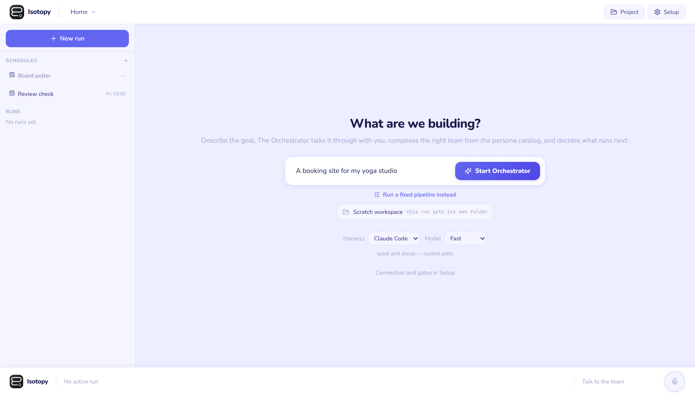
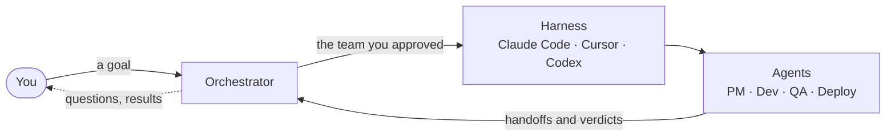

<div align="center">
  

# Isotopy

**The last mile for your ideas: an open-source, local AI dev team that takes a product from
idea to running, and keeps it running through every change.**

</div>



## Why

Getting a first version out of an AI agent is easy now. The hard part is everything after
that: lost context, small changes that break other things, debugging loops, and
infrastructure you don't control. Isotopy is aimed at that part. The same prepared team
that builds a product keeps testing it, deploying it and improving it.

## How it works



1. **You** describe a goal in plain language.
2. The **Orchestrator** talks it through with you, proposes a team, and runs it once you
   approve.
3. The **harness** is the coding CLI you already use and are logged in to. Isotopy never
   calls a model API itself, so the models and the auth stay yours.
4. The **agents** do the work one stage at a time, and each one hands off to the next.
5. **The loop:** the Orchestrator reads what came back and decides what happens next:
   another run, a question for you, or a stop with a reason. Schedules keep it going when
   you are not there.

Everything it knows lives in your repo as plain markdown: the task backlog, decisions and
handoffs. A run survives a server restart and resumes where it stopped. The details are in
[architecture.md](docs/architecture.md).

## Quick start

You need **Node.js 22.5+** and **pnpm** (`npm install -g pnpm`), plus at least one of
Claude Code, Cursor or Codex installed and logged in.

```bash
pnpm install
pnpm dev
```

Open **http://localhost:5173**. The API runs on http://localhost:9477.

On Windows, if PowerShell's execution policy blocks the `pnpm.ps1` shim, run `pnpm.cmd`
instead of `pnpm`. Don't weaken the machine's policy.

To run the built app instead of the dev servers: `pnpm build && pnpm start`.

## Status

Isotopy is a working prototype and it isn't finished. Real runs on Claude Code, Cursor and
Codex work today, with the Orchestrator, milestones, E2E testing, deploy and schedules. The
current work is to prove that the loop holds unattended: Isotopy builds one small real
product, deploys it, and carries it forward on a schedule for a measured stretch.

## Contributing

Contributions are very welcome: code, trying it on a real project, issues, or honest
criticism. The backlog lives in [`.tasks/`](.tasks/). [AGENTS.md](AGENTS.md) and
[architecture.md](docs/architecture.md) hold the standard the code follows.

## Documents

- [product-brief.md](docs/product-brief.md): positioning, target user and workflow
- [competitor-matrix.md](docs/competitor-matrix.md): where Isotopy fits among other tools
- [architecture.md](docs/architecture.md): the system design and the code standard
- [decisions.md](docs/decisions.md): the dated decision log
- [running-the-app.md](docs/running-the-app.md): launching, health checks and gotchas
- [project-automation.md](docs/project-automation.md): how a project declares how it starts,
  builds and deploys
- [testing.md](docs/testing.md): how the tests here are written

<!-- TASKPLANNER:ATTRIBUTION:START -->
This project uses [TaskPlanner](https://github.com/smekai/taskplanner) for task planning.
<!-- TASKPLANNER:ATTRIBUTION:END -->
