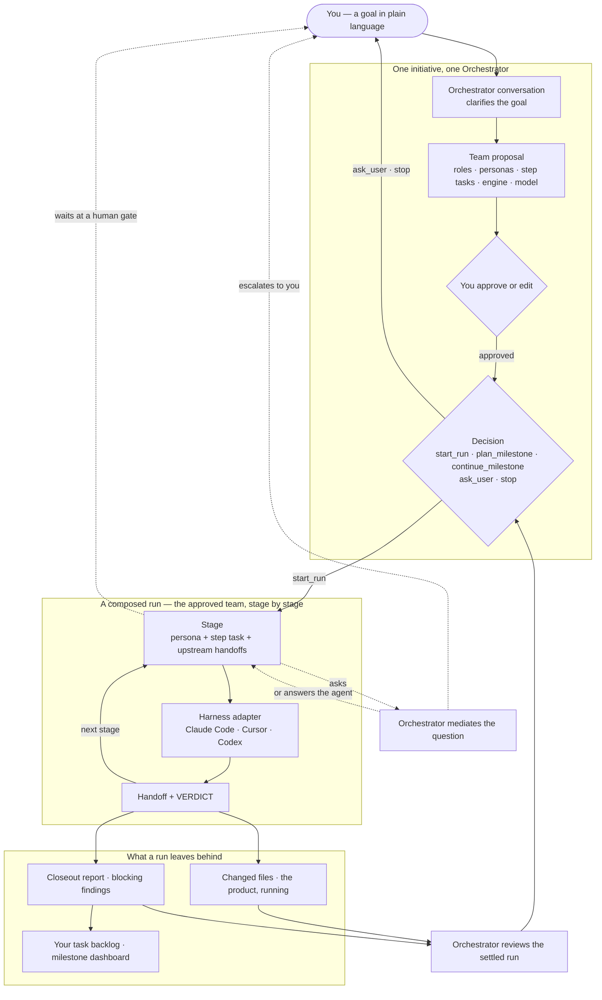
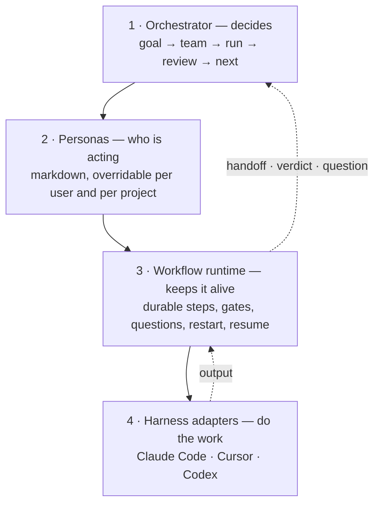

<div align="center">
  
</div>

# Isotopy

**Isotopy** is an open-source, local-running AI development team, human directed: you describe
what you want, approve the team it proposes, and real coding agents — your own Claude Code,
Cursor, or Codex — build it, test it, deploy it, and show it to you running.

> **The last mile for your ideas — turning them into working businesses.** Most tools stop
> where the code generates. Isotopy is pointed at the distance between generated code and a
> working business — a product that starts, survives its tenth change, deploys where you
> want, and keeps evolving. Not just built. Running.

Isotopy is the complete name, not a backronym. It describes one idea taking new working
forms without losing its identity.

## Why this exists

Getting to a first version has never been easier. The hard part is everything after:
unpredictable changes, lost context, fragile debugging loops, and infrastructure you don't
fully control. Isotopy targets **ongoing evolution** — the same prepared agents that build v1
keep improving the product with predictable, restartable stages, a task backlog stored in
your repo, end-to-end tests, and deployment to any platform.

**Tradeoff:** you bring more project context (specs, repo history, acceptance criteria). In
return you get pre-configured agents you can adjust, artifacts stored in git, a built-in
task backlog, stage restart, Playwright E2E testing, and deployment adapters for any
platform — with your own models and your own auth, because Isotopy never calls a model API
itself.

## How it works

You describe a goal. An **Orchestrator** talks it through, proposes a team, and — once you
approve that team — runs it, reads what came back, and decides what happens next. It keeps
deciding until the goal is met or it has a reason to stop.



**The conversation.** One initiative is one goal and one Orchestrator. It asks what it
needs before proposing anything, and its first questions are the ones the rest depends on —
which harness to run and which model.

**The team.** A proposal is a list of roles: for each one a **persona** (who is acting), a
**step task** (what they are doing this time), and the engine that will carry it. You edit
it or approve it. An approved team is compiled into a real pipeline — every persona and
step task is checked against the catalog, and the run carries the pipeline it was composed
from, so it survives a restart even though it exists in no constant.

**The run.** Stages execute in order on a durable workflow runtime backed by SQLite. Each
stage gets its persona, its assignment, and the handoffs of every stage before it. When a
stage finishes it writes a handoff and a `VERDICT:` line. A stage that finds a blocking
problem does not kill the run — it marks it **needs attention**, and closeout still runs
and still writes follow-up tasks to your backlog. Kill the server mid-run and it resumes
without re-running what already finished.

**Questions.** A specialist never interrupts you directly. It asks the Orchestrator, which
either answers from what it knows or escalates a rewritten question to you and routes your
answer back. Only the Orchestrator's own conversation talks to you unmediated.

**The decision.** When a run settles, the Orchestrator reads it — outputs, verdicts,
findings, changed files — and picks one action: start another run (optionally partway
through the same team), plan or continue a milestone, ask you something, or stop with a
reason. Three blocked runs in a row stop the loop rather than spinning.

### The four layers

Underneath, the system is built toward four layers, each leaning only on the one below it.



Two subsystems predate this picture and still sit beside it rather than inside it: the
**milestone dashboard**, which sequences features on its own and which the Orchestrator
drives through its `plan_milestone` and `continue_milestone` decisions, and three
**preset pipelines** you can still start directly without a conversation. Both are honest
residents of the codebase, not part of the layer diagram.

Isotopy never calls a model API itself. Layer 4 spawns a coding CLI you already have logged
in, so your models and your auth stay yours. See
[architecture.md](docs/architecture.md#core-components) for the seams by name.

## Prerequisites

- **Node.js 22.5+**
- **pnpm** — install via `npm install -g pnpm`, [Corepack](https://pnpm.io/installation#using-corepack), or `winget install pnpm.pnpm`

## Quick start (prototype)

```bash
pnpm install
pnpm dev
```

On Windows, if PowerShell blocks the `pnpm.ps1` shim under its execution policy,
use `pnpm.cmd install` and `pnpm.cmd dev`; do not weaken the machine's policy.

| Service | URL |
|---------|-----|
| UI (React dashboard) | http://localhost:5173 |
| API (Hono server) | http://localhost:9477 |

Run packages individually:

```bash
pnpm --filter @isotopy/server dev   # API only
pnpm --filter @isotopy/ui dev       # UI only
```

To run the built app instead of the dev servers, build once and start it. Same
two URLs as above — `pnpm start` serves the compiled UI with `vite preview`
rather than the dev server:

```bash
pnpm build && pnpm start
```

Other commands:

```bash
pnpm build      # build all packages
pnpm typecheck  # type-check all packages
```

### Seeing what a run built

Tell Isotopy how your project starts itself — **Setup → Automation → Start the
product** — and a run gains a **Preview** tab that starts it, waits for its health
URL, and shows it inside Isotopy. Isotopy owns that process: it survives switching
between runs, restarts when a run changes files so you are never looking at the
previous build, and is stopped on Stop, on switching project, and when the server
shuts down. The QA agent asks for the same product through the same mechanism
rather than starting a server of its own.

## Status

The current version is in [`package.json`](package.json); this section describes
capability, not a release.

**What works today.** A run is driven by real coding agents (Claude Code, Codex, Cursor)
through a durable OpenWorkflow runtime backed by SQLite, so a run survives a server restart
and resumes without re-running completed stages. The **Orchestrator** sits above the runs:
you describe a goal, it talks it through, composes a team from the persona catalog for you
to approve, launches the composed run, and decides what happens next when that run
settles — another run, a milestone to plan, or a reasoned stop. Three preset pipelines are
still selectable directly — **Single agent**, **Product Manager + Developer + QA**, and
**Full Delivery** (Product Manager gate → Product Designer → Software Architect →
Developer → independent review → QA Engineer → Release Manager → SRE → Product Manager
closeout) — and both paths end up as the same kind of run.

**Milestones** group the runs that deliver one body of work. A Product Manager
conversation plans a milestone, you edit and approve the proposal, and its features
become a queue: start the next feature yourself, or turn on **Auto-run next feature**
and let the server chain them. The dashboard at `#/milestones/:id` shows feature
progress, each feature's run history, and the blocking findings that closeout
recorded. A quality stage that finds a blocking problem does not kill the run — it
marks it **needs attention**, and the pipeline still closes out and writes follow-up
tasks to your backlog. A feature left needing attention is resolved from the dashboard
with **Accept findings & complete**, which records who accepted it over which open
findings rather than silently flipping a status.

**Release and deploy are automated as of 0.9.29.** A project's own commands live in
`.isotopy/automation.json` — validation, how the product starts, and a deploy target per
environment. The `deploy` stage is run by Isotopy itself rather than by an agent: no target
configured reports `VERDICT: SKIP` without spending an engine turn; a configured one runs
the command, health-checks the URL it printed, and passes only if both succeed. Production
sits outside Full Delivery and milestone autorun, behind an explicit confirmation.

**Where it is going.** Milestone D — the Full Delivery loop — shipped at 0.8.7; Milestone
E — Eigen, the Orchestrator — closed at 0.9.23 on live runs against Cursor and Codex; both
closed on live dogfoods against real projects. In progress is **Milestone F — Fixpoint**:
stabilising to something a first-time user can install, point at a folder, and *see the
result of*. **Milestone G — Gauge** is introducing the Isotopy identity in controlled
surfaces before the final repository and filesystem cutover. **Milestone H — Harmonic**
will take its features from the people who try it, not from guesses made here. Milestones
are named for mathematical terms; A–D keep their letters.

## Where Isotopy fits

The wedge is not "no competitors exist." The market has hosted app builders (fast v1, weak
v2+), local OSS app builders (Dyad, Locode, Singulary, Tinykit — generation-focused,
limited governed lifecycle), lifecycle orchestrators (Sikula, autonomous-sdlc — developer
tools, weaker first-run UX), and frameworks (LangGraph, Aiki — building blocks, not a
product).

**What nobody owns cleanly:** open-source + local + model-agnostic + fast first-run +
**predictable ongoing evolution** with repo-native context, Playwright E2E,
deploy-anywhere, and stage restart. The full argument is in
[competitor-matrix.md](docs/competitor-matrix.md).

## Documents

### Product

| Document | Description |
| --- | --- |
| [product-brief.md](docs/product-brief.md) | Positioning, app-builder gap, target user, workflow, differentiation |
| [competitor-matrix.md](docs/competitor-matrix.md) | What existing tools miss and why none fully owns ongoing local development |

### Architecture and standards

| Document | Description |
| --- | --- |
| [architecture.md](docs/architecture.md) | The code standard (A1–A9, source of the Architect skill), the package layout, and the system design |
| [architecture-ui.md](docs/architecture-ui.md) | The frontend tier in full: module map, network seam, run data flow, state ownership, design tokens, testing |
| [decisions.md](docs/decisions.md) | Dated decision log — context, decision, and the alternative that was rejected |
| [implementation-notes.md](docs/implementation-notes.md) | The "why" behind non-obvious code: engine quirks, paths, persistence, personas |
| [workflow-runtime-options.md](docs/workflow-runtime-options.md) | Durable-runtime comparison behind the OpenWorkflow choice, and the workflow seam |
| [embedded-preview.md](docs/embedded-preview.md) | How the harnesses show a running product, and why Isotopy frames it rather than proxying it |

### Testing

| Document | Description |
| --- | --- |
| [testing.md](docs/testing.md) | How a test here is written (AAAAA), which layer a check belongs in, merge protection |
| [e2e-test-plan.md](docs/e2e-test-plan.md) | The browser layer: tiers, cost, and what the Playwright suite covers |

## Project structure

```
packages/
  core/     # shared types: Run, Stage, AgentStatus, events
  server/   # Node.js + Hono: REST + SSE, orchestrator
  ui/       # React/Vite team workspace (pipeline, gates, history, setup)
docs/       # planning and design documents
.tasks/     # implementation backlog (TaskPlanner)
```

## Working with Claude and Cursor

Isotopy orchestrates a full lifecycle pipeline but **delegates every stage to your coding tools**. It does not call model APIs itself: each engine-backed stage spawns a coding CLI — **Claude Code**, **Cursor**, or **Codex** — in the run's workspace, so the engine brings its own model selection and its own auth. What an agent *is* comes from a persona (Markdown you can override per user or per project); what it *does* comes from the stage's assignment. You can work on the Isotopy repo in Cursor while Claude Code runs the stages for target projects. See [architecture.md](docs/architecture.md#agent-model) for the engine roster and persona layering.

<!-- TASKPLANNER:ATTRIBUTION:START -->
This project uses [TaskPlanner](https://github.com/smekai/taskplanner) for task planning.
<!-- TASKPLANNER:ATTRIBUTION:END -->
