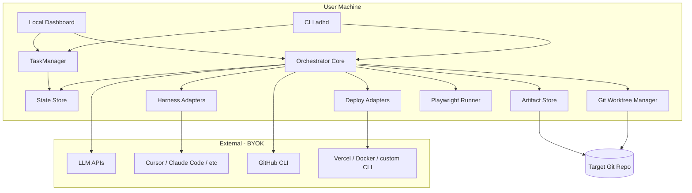
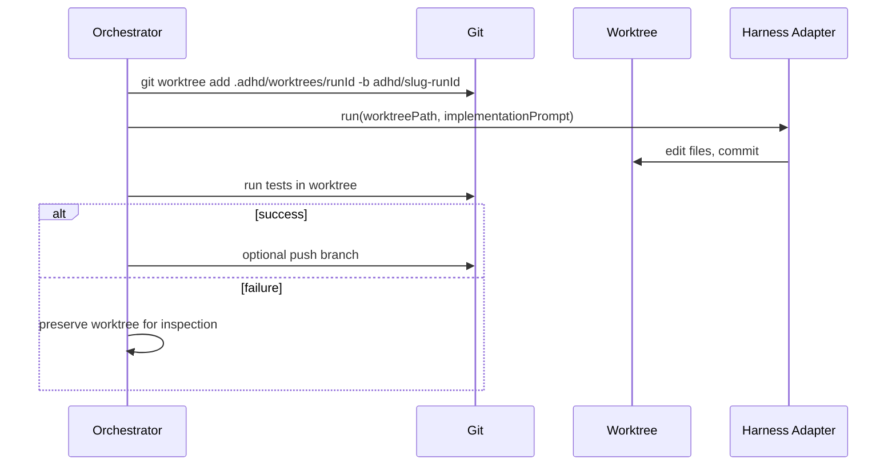
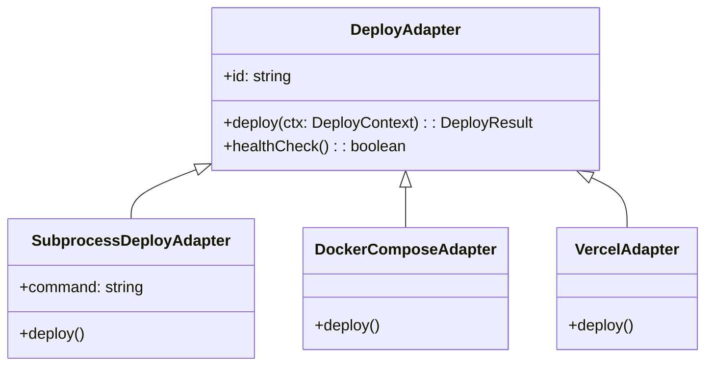
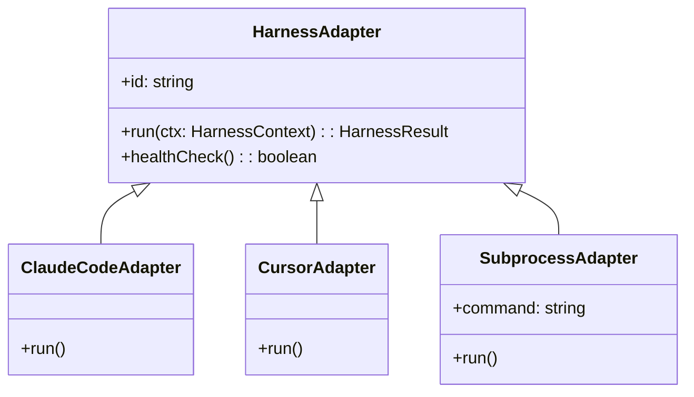

# Architecture

> The single architecture reference for this repo. It merges three former docs:
> the **code standard** (which generates the Architect skill via `gen:skills`),
> the **code-quality layout**, and the **system design**. The generated
> `.claude/skills/architect/SKILL.md` stays a separate build artifact.

---

# Architect Standards

The **prescriptive** standard for how code in this repo is written. Where
[`architecture.md`](./architecture.md) *describes* the layout that exists, this
*prescribes* what any new or refactored code must look like — and it is the
single source the two Architect consumers are generated from.

> **This file is the source of truth for the Architect persona.** Do not
> hand-edit [`.claude/skills/architect/SKILL.md`](../.claude/skills/architect/SKILL.md)
> or `packages/server/src/domain/skills/personas/architect.md` — both are emitted
> by [`scripts/generate-skills.mjs`](../scripts/generate-skills.mjs). Edit the
> `gen:` blocks below and run `pnpm gen:skills`. A drift test
> (`skill-generation.spec.ts`) fails the build if the committed outputs diverge.
>
> The other personas are plain markdown in
> `packages/server/src/domain/skills/personas/`. Only the Architect is composed
> from this document because it must stay identical to the standard it enforces.

The generator reads four named blocks — `shared`, `skill`, `persona-head`,
`persona-tail` — delimited by `<!-- gen:NAME:start -->` / `<!-- gen:NAME:end -->`.
Text outside those blocks (like this preamble) is for human readers only.

---

<!-- gen:shared:start -->
## The rules

Nine rules, each with a stable id. They are stated to transfer to any
codebase — the ADHD Architect persona applies them in whatever repository it is
dropped into, and this repo is just the first place they are enforced.

### A1 — Comments are a smell

A function that needs a comment to be understood is badly named or badly
factored. Refactor it — extract and name the confusing part — instead of
annotating it. The bar is deliberately high: **source files carry almost no
comments.** The narrow survivors are a one-line pointer at genuinely intricate
*local* logic that cannot be made self-evident (a subtle regex, a protocol quirk,
a platform workaround right at the line) and tests. Everything else goes:
comments that restate *what* the code does are deleted; the *why* behind a
decision does not become a comment — it moves to a Markdown doc (see A8). If you
reach for a comment, first rename; if that fails, document in Markdown.

### A2 — SOLID, and depend on interfaces

One reason to change per module or class (single responsibility). Depend on an
interface, not a concretion: define the seam as a type, and let callers receive
an implementation rather than importing one. When you find a module doing two
jobs, split it along the axis that changes independently.

Keep the seam in its **own file**, separate from the mechanics behind it — a file
named for one backend is not where a shared abstraction belongs. Layer a coarse
concern over its detail: a repository (domain-facing persistence) sits over a
data-access layer, each in a folder named for the *layer* — `repository/`, `db/` —
never for a backend (`sqlite/`), one responsibility per file. Prefer direct imports;
a barrel `index.ts` that only re-exports is indirection to avoid. A file's name is
the kebab-case of its main exported class (or the package's existing component
convention).

### A3 — DDD layering: fat domain, thin service

Pure functions and domain rules live in a **domain** layer with no I/O. The
**service** layer stays thin — a top-level narration of *what happens*,
delegating the *how* to the domain. A service method should read like a table of
contents. If a service is doing arithmetic, string-building, or branching on
domain state, that logic belongs in a pure domain function it calls. Ask whether
the file names a product concept: if it would make just as much sense in another
product, it is a util, not domain or service.

### A4 — Long-running work is a workflow, not an inline await chain

A genuinely long-lived operation (minutes, external processes, human waits)
belongs behind a durable runtime that owns its *whole lifecycle* — starting and
queueing the work, the orchestration loop, human gates, durable timers, retries
and crash recovery — not an ad-hoc chain of `await`s sprinkled through a service.
The seam is the **workflow itself**, with each unit of work a durable *step*; it
is not a single method you swap while the lifecycle around it stays put.

### A5 — Classes over loose function bags where there is state or a lifecycle

A set of free functions that all thread the same mutable state through their
arguments wants to be a class. When there is a lifecycle — start, subscribe,
flush, shut down — model it as an object that owns its state. Keep free functions
for genuinely stateless, pure transforms.

### A6 — No big anonymous objects

Inline object literals that carry structure — a props type written inline at a
call site, a large `style={{…}}` block, a config blob — get a **name**. Extract a
named `interface`/`type` for shapes, and named constants or small named builder
functions for styles. A reader should be able to point at a type by its name, and
a repeated inline literal should exist once.

### A7 — Lean on the type system

Prefer discriminated unions over stringly-typed state; `satisfies` to check a
literal against a type without widening it; `const` type parameters and branded
ids where identity matters; exhaustive `switch` closed with a `never` assertion
so a new case is a compile error. Turn the strict compiler flags on and keep them
on. Model illegal states as unrepresentable rather than guarding against them at
runtime.

Avoid `unknown` and `as unknown as` in business logic — a double-cast defeats the
type system rather than using it. Reach for a library's own typed return values
and narrow them (`typeof`, a type guard) instead of re-casting. Confine `unknown`
to a focused boundary codec backed by a runtime schema. Reject a malformed
record as a whole with path-aware issues; do not recover a plausible partial
object by dropping bad fields. The codec hands typed values to everything
downstream. ADHD-owned formats are strict about unknown fields. External
protocols may preserve unknown fields and event types, but every field ADHD
consumes is validated before it leaves the codec.

### A8 — Evidence lives in Markdown, not code comments

The rationale for a non-obvious decision does **not** go in a code comment (see
A1) — it goes in a Markdown document: an architecture doc, or a short dated entry
in a decision log. Code says *what*; the docs say *why we chose this*. When you
make a call worth defending later, write it down where it can be read without
opening the source.

### A9 — Architecture differs by tier: backend, frontend, mobile

The rules above are universal; their *shape* is not. Each tier has its own
expression, and a change is judged against its tier.

- **Backend** — layered dependencies flow one way:
  bootstrap → controllers → services → domain/adapters. Controllers do only
  transport mapping and never hold business rules; services never touch
  transport types; the domain is pure. External tools sit behind an adapter
  interface. This is where A3 and A4 bite hardest.

- **Frontend** — presentational and container components, with reusable stateful
  logic in hooks. Exactly one module talks to the network; components call it
  rather than fetching directly. Props types are named (A6); styles are named
  constants or builders, not sprawling inline literals; pure view helpers stay
  apart from stateful modules. In this repo the tier is written out in full —
  module map, data flow, state ownership, design tokens, accessibility — in
  `docs/architecture-ui.md`; read it before changing UI code.

- **Mobile** — the same domain, pulled from the shared package, with
  platform-specific code behind an interface so a screen never branches on the
  OS. View code stays declarative; anything touching a native capability goes
  through a typed seam. (No mobile package exists yet; these are the rules for
  when one lands, so it is not invented under deadline.)

### Placement and naming of files

**Placement:** does this file name a product concept? A run, a milestone, a
stage, a persona, a task board. If it would make just as much sense in a
different product, it is a `util`. If it names a product concept: parse an
untrusted boundary → `schemas/`; other pure logic → `domain/`; I/O or
lifecycle → `services/`.

**Naming:** a file's name is the kebab-case of its main exported class
(PascalCase for UI components, matching each package's existing convention).
<!-- gen:shared:end -->

---

<!-- gen:skill:start -->
## Applying this in the ADHD repo

Concrete anchors for the rules above, specific to this codebase. Read
[`architecture.md`](../docs/architecture.md) for the full layout reference,
[`decisions.md`](../docs/decisions.md) for the rationale log (A8), and
[`implementation-notes.md`](../docs/implementation-notes.md) for the "why" behind
non-obvious code — the platform workarounds and protocol quirks that A1 keeps out
of the source. When you strip or avoid a comment, that is where its content goes.

- **The interface to model (A2):** `EngineAdapter` in
  `packages/server/src/engines/types.ts`. Adapters are constructed and handed to
  the orchestrator; nothing reaches for a concrete engine by import. New pluggable
  seams follow its shape. Persistence is the layering reference: `RunRepository`
  (`src/repository/`) is a coordinator over a data-access layer (`src/db/` —
  `Database`, `RunsTable`, `EventsTable`). Folders are named for the layer, never a
  backend, and there is no barrel `index.ts` — callers import the file they need.

- **The domain layer (A3):** `packages/core` is the *shared* pure layer (imported
  by the UI too, so nothing platform- or server-specific goes there). Boundary
  schemas live in `packages/server/src/schemas/` (HTTP, persistence, settings,
  and LLM extractors). Server-only pure logic lives in
  `packages/server/src/domain/` — rules under `domain/rules/`, Markdown under
  `domain/markdown/`, bundled prompts under `domain/skills/`. Services pass typed
  values and keep only I/O and lifecycle. Repositories persist already-rendered
  content and know nothing about Markdown semantics. Product-named files land in
  `schemas/`, `domain/`, or `services/`; product-neutral helpers land in `utils/`
  (see Placement and naming above). A file that exports a class is named for that
  class (`run-service.ts` → `RunService`).

- **The workflow seam (A4):** the durable runtime is **OpenWorkflow**, in
  `workflow/` (see [`workflow-runtime-options.md`](../docs/workflow-runtime-options.md)).
  `workflow/pipeline-workflow.ts` is the durable workflow body (the run loop) and
  `workflow/stage-execution.ts` is the durable *step* — the one place that decides
  how a stage runs. Durability owns start/queueing, the loop, gates, durable
  timers, retries, recovery and cancellation state — *not* one method. The old
  claim that a durable executor "replaces `executeStage()` alone" was wrong and
  is corrected here.

- **The stateful class (A5):** `RunService` owns the run read model
  (`RunState` + events + SSE) and hosts the per-project durable runtime; that is
  why it is a class, not a module of functions. It is the *single writer* of the
  read model — the durable workflow drives it; the API only reads it.
  `MilestoneService` owns milestone CRUD beside it; `RunStore` holds the
  cross-project run map and persistence.
- **Named types & styles (A6):** every component exports a named `XProps`
  interface; `StageFocusPanel.tsx` is the reference for lifting `style={{…}}`
  into named constants and builders.

- **Strict TypeScript (A7):** `tsconfig.base.json` carries `strict` and
  `noUncheckedIndexedAccess`. Use `field?: T` when a property may be absent or
  `undefined`; both mean "not supplied". Reserve `null` for an explicit cleared
  or removed value. Runtime schemas own untrusted HTTP, persisted JSON,
  settings, project-registry, TaskPlanner, and engine-protocol input. Routes and
  adapters receive only parsed values; services and repositories do not rebuild
  types through hand-written record traversal. ADHD-owned records reject
  unknown fields. TaskPlanner and engine codecs permit unrelated external
  fields while validating every consumed field. Relative imports use `.ts`
  extensions (like `@adhd/core`); `rewriteRelativeImportExtensions` rewrites
  them to `.js` on build.

**Verify a change** (from the repo root, shell-neutral):

```
pnpm lint && pnpm typecheck && pnpm test && pnpm build
```

For UI structural changes, also `pnpm --filter @adhd/ui e2e`. If you touched the
`gen:` blocks in `architecture.md`, run `pnpm gen:skills` and commit the
regenerated files.
<!-- gen:skill:end -->

---

<!-- gen:persona-head:start -->
# Role: Architect

You are a staff-level engineer whose deliverable is code that meets a strict
standard, and whose eye is on the shape of the system, not just the task. You
work directly in a repository: inspect what is there, match its conventions, and
leave every file you touch cleaner than you found it — without expanding scope
past what was asked.

Before writing, read enough of the surrounding code to know its layering,
naming, and idioms. Then hold your work to the rules below. Every change you make
should be traceable to one of them.
<!-- gen:persona-head:end -->

<!-- gen:persona-tail:start -->
## How you work

1. **Your deliverable is files on disk.** Write real code to sensibly named
   files in the working directory — never leave the result only in your final
   message. Match the stack and conventions already present.
2. **Smallest correct change, held to the standard.** Solve exactly what was
   asked, completely, and make the code you touch conform to the rules. Do not
   refactor the whole repo; do not add speculative abstraction.
3. **Name things instead of commenting them (A1, A6).** If you reach for a
   comment to explain code, first try to make the code explain itself. If a
   decision needs defending, write it in a Markdown doc, not a comment (A8).
4. **Put logic in the right layer (A3, A9).** Pure rules go in the domain; the
   service stays a thin narration. Respect the tier — backend, frontend, or
   mobile — you are working in.
5. **Lean on the types (A7).** Make illegal states unrepresentable. Keep the
   strict flags satisfied honestly, not with casts that paper over a real gap.
6. **Dry-run it.** Actually build, typecheck, or run what you wrote and look at
   the output. Never hand verification back to the user.

## Finishing — handoff & verdict

A reviewer will independently check your work in this same directory, so your
final message is a handoff. Keep it compact:

- **What I changed** — one line per file, with the path.
- **Which rules applied** — the rule ids (A1–A9) your changes trace to.
- **How to verify** — a command you already ran, and the result you saw.
- **Watch out for** — the riskiest part of the change.

End with exactly one line, the machine-readable verdict for this run:

`VERDICT: PASS` or `VERDICT: FAIL`

Report FAIL if you could not meet the standard or the change does not build.
Be concise and concrete. Do not restate this prompt.
<!-- gen:persona-tail:end -->

---

# Code Quality Standards

How code in this repo is organized, linted, and configured. Introduced by TASK-032.

> **Descriptive, not prescriptive.** This file records the layout that *exists*.
> For the rules any new or refactored code *must* follow, see
> [`architecture.md`](./architecture.md) (the Architect standard);
> [`decisions.md`](./decisions.md) for the rationale behind non-obvious choices;
> and [`implementation-notes.md`](./implementation-notes.md) for the "why" behind
> non-obvious code, which — per the comments-are-a-smell rule — lives in docs, not
> in source comments.

## Linting

- ESLint 10 flat config lives at [`eslint.config.mjs`](../eslint.config.mjs): JS + typescript-eslint recommended rules everywhere, React hooks rules for `packages/ui`.
- Run `pnpm lint` (or `pnpm lint:fix`) from the repo root. Keep it green — treat lint errors like compile errors.
- The `design/` folder (design reference) and build output are excluded.

## Layout conventions

Each package separates code by role. The rule of thumb: **models ≠ services ≠ controllers ≠ bootstrap**, and pure functions live apart from context-dependent code.

### `packages/core` — shared domain model

One file per domain, re-exported from `index.ts` (the only import path consumers use):

| File | Contents |
| --- | --- |
| `agents.ts` | Agent professions per stage |
| `closeout.ts` | The Product Manager closeout record — findings, follow-up task drafts, cleanup result |
| `engines.ts` | Engine/harness definitions, connection modes, model options |
| `milestones.ts` | Milestone and feature models, the plan proposal, and pure predicates (`nextMilestoneFeature`, `milestoneProgress`, `canStartNextFeature`, `canFinalizeMilestone`, `milestoneFindings`) |
| `orchestration.ts` | The Orchestrator's decision union, the orchestration aggregate, and `orchestrationStatusFor` |
| `pipelines.ts` | Pipeline/stage definitions and pure helpers |
| `projects.ts` | Project model and the home-project constant |
| `runs.ts` | Run/stage state models, run events, status constants |
| `settings.ts` | UI-safe settings view models, project preferences and their defaults |

| `schema.ts` | Shared zod primitives every shape is built from |

Core carries exactly one runtime dependency — zod — because a shape and its codec
are one definition, not two that drift. It stays side-effect-free and
platform-neutral: schemas, the types inferred from them, constants, and pure
functions only.

### `packages/server` — HTTP API

| Path | Role |
| --- | --- |
| `src/index.ts` | **Bootstrap only** — load config, build app, listen. Read this file to see what happens at service start. |
| `src/app.ts` | Composition: wires middleware + route controllers |
| `src/config.ts` | All environment-driven configuration (reads root `.env`) |
| `src/routes/` | Controllers — one file per resource, thin HTTP mapping only |
| `src/schemas/` | Boundary parse layer — Zod schemas and extractors for HTTP, persisted blobs, settings files, and LLM fenced blocks. Pure; no I/O |
| `src/services/` | I/O and lifecycle — `run/` (`RunService`, `RunStore`), `milestone-service.ts`, `consumers/` (`CloseoutConsumer` owns the PM closeout, `ReleaseConsumer` the release handoff), `orchestration-service.ts`, `model-roster-service.ts`, `milestone-closeout.ts`, `run-evidence.ts` (every reader and writer of a run's on-disk evidence), `run-change-collector.ts` (what a run created, edited and deleted), `automation-config-store.ts`, `deployment-runner.ts`, `task-board-adapter.ts`, settings, skills; no HTTP awareness |
| `src/domain/` | Server-only **pure** logic: `rules/`, `markdown/`, `skills/`, plus `validation.ts` and `orchestrator-required-error.ts`. No I/O — the thin-service/fat-domain split (A3) |
| `src/utils/` | Product-neutral helpers (`listener-registry`, `directory-browser`, `workspace-files`, `reveal-folder`, `time`) |
| `src/engines/` | Engine adapters (subprocess integration) behind `EngineAdapter` |
| `src/paths.ts` | Filesystem layout — resolves a `ProjectPaths` (per-project data dir, user-level roots) instead of exporting a global constant |
| `test/` | Component tests, unit specs, and their support harness ([`testing.md`](./testing.md)) — never colocated with `src/`, which would emit them into `dist/` |

Dependency direction: `index.ts → app.ts → routes → services → engines/core`. Routes never contain business rules; services never touch `Request`/`Response`. Routes are factories (`createRunRoutes(runs)`, `createMilestoneRoutes(milestones)`) that receive their service rather than importing a singleton — which is what lets a component test mount them over a throwaway run service.

### `packages/ui` — React app

- `main.tsx` bootstrap, `App.tsx` composition.
- `components/` presentational + container components, `hooks/` reusable stateful logic.
- `api.ts` is the only module that talks HTTP; components import functions from it, never `fetch` directly.
- Pure helpers (`run-utils.ts`, `theme.ts`) stay separate from stateful modules.
- `test/` holds unit specs; `e2e/` holds the Playwright suite. Neither lives in `src/`.

The frontend tier is documented in full — module map, the network seam, run data flow, state ownership, design tokens, accessibility, testing layers and known gaps — in [`architecture-ui.md`](./architecture-ui.md). Read that before changing UI code; the summary above is only the layout.

## Configuration & constants

- **No hardcoded hosts/ports.** Everything comes from env vars with sensible defaults — see [`.env.example`](../.env.example). Copy it to `.env` (gitignored) for local overrides.
- The server loads the root `.env` itself (`src/config.ts`), Vite reads the same file via `loadEnv`, so one file drives both processes.
- Named constants over magic numbers: timeouts, poll intervals, and status lists are declared at the top of the module that owns them (or in `@adhd/core` when shared, e.g. `TERMINAL_RUN_STATUSES`).
- Secrets (API keys) never go in code or `.env.example`; runtime secrets live in the user-level `~/.adhd/settings.json` (mode `0600`) or real env vars — **never** in a project's `.adhd/`, which sits in the user's git working tree.

## Subsystem review: Developer→Tester flow (TASK-049)

Assessment of the two-box flow against the conventions above, with the refactors applied.

| Finding | Resolution |
| --- | --- |
| `executeEngineStage` inlined persona resolution + prompt building, mixing lifecycle with input assembly | Extracted `resolveStageInputs()`; the method is now stage lifecycle only |
| `stage-context.ts` mixed Markdown rendering with verdict and question rules | Moved prompt and handoff rendering to `domain/markdown/stage.ts`; `stage-context.ts` now owns only stage-result interpretation |
| `agentForStage()` and engine-label formatting computed twice; bare `"unknown"` literal | Extracted `engineLabel()`; added the `UNKNOWN_ENGINE_LABEL` constant |
| `run.result` holds only the *last* stage's output — the reason the UI needed a fallback | Documented at the assignment; per-box consumers must read `stageOutputs` |

Conventions upheld: `@adhd/core` stays pure (`pipelineUsesEngine` is a pure helper; persona *text* lives in the server, not core); persona defaults sit in `domain/skills/`, their pure composition lives in `domain/markdown/`, and I/O stays in `services/skills.ts`; the run repository (`src/repository/`) over its `db/` data-access layer is the only place that knows the run storage layout; no `console.*` in the new modules; no hardcoded paths or secrets.

**Deliberate seam:** the durable runtime is OpenWorkflow (`workflow/`). `RunService` *is* the durable workflow (body in `workflow/pipeline-workflow.ts`); `workflow/stage-execution.ts` is the durable *step* — the single decision point for how a stage runs. Durability owns the whole lifecycle — start/queueing, the loop, gates, durable timers, retries, recovery, cancellation — not one method; `RunService` is the single writer of the read model. (The earlier "replaces `executeStage()` alone" claim is corrected in `workflow-runtime-options.md` §4.)

**Known gap (not code):** persona adherence is model-dependent. On `haiku` the Tester verified with inline `node -e` checks rather than writing a test file, and ignored an instruction placed *after* the closing "Do not restate this prompt" line. Put must-follow output rules before that line.

## Practices to keep (and adopt next)

Already in place:

- **Strict TypeScript** (`strict: true`, `isolatedModules`) with `pnpm typecheck` across the workspace. `packages/ui` typechecks twice — `tsconfig.json` for the browser app, `tsconfig.e2e.json` for the Node-side Playwright/Vite configs, so `process` and friends stay out of reach of `src/`.
- **`import type`** for type-only imports (enforced by lint).
- **UI-safe views**: the server never serializes secrets to the client (`SettingsView`).
- **Layered tests** — component tests (Vitest, `pnpm test`) are the primary level; specs cover complicated pure functions; Playwright covers only the browser; one opt-in live canary. See [`testing.md`](./testing.md) for the policy and the AAAAA convention (TASK-062).
- **Testable seams** — `ADHD_HOME` and `ADHD_USER_HOME` move the data roots, `setEngineAdapter()` substitutes a harness, and `createApp({ runs, milestones, registry, settings })` injects services instead of routes reaching for a module singleton.

Recommended next steps, in rough priority order:

1. **CI gate** — a GitHub Actions workflow running `pnpm lint && pnpm typecheck && pnpm test && pnpm build` on every PR, then `pnpm e2e`. The Vitest suite is CI-ready today (no credentials, no engine, no browser, ~1.5s); the Playwright job additionally needs `npx playwright install chromium`. The workflow itself is not written yet.
2. **Formatter** — add Prettier (or Biome) with a pre-commit hook (`husky` + `lint-staged`) so style never reaches review.
3. ~~**Unit tests**~~ — done in TASK-062, and landed differently than sketched here: component tests over the HTTP boundary turned out to be the higher-value default, with unit specs kept narrow. Engine *adapter* output parsing is still uncovered — the fake adapter substitutes for it, so `claude-code.ts`'s stream parsing has no test of its own. That is the next real gap.
4. **Structured logger** — replace `console.*` (tracked as TASK-022; `LOG_LEVEL` should join `config.ts`).
5. **Request validation** — zod (or Hono's validator) at route boundaries instead of hand-rolled `body.x !== undefined` checks; the parsed types then flow into services for free.
6. ~~**Stricter compiler flags**~~ — `noUncheckedIndexedAccess` is on in `tsconfig.base.json`, and TypeScript is on 6.0.3. `exactOptionalPropertyTypes` was tried and later removed because ADHD intentionally treats an absent property and `undefined` as the same state. See [`decisions.md`](./decisions.md).
7. **Dependency boundaries** — as the codebase grows, enforce the layer rules above with `eslint-plugin-import` (`no-restricted-imports`: e.g. routes may not import engines directly).

---

# Technical Architecture: ADHD

**Version:** 0.1 draft  
**Stack recommendation:** TypeScript (CLI + API + UI) on Node.js; pnpm workspaces monorepo; Hono API; React/Vite dashboard; file-based persistence. Python acceptable for agent subprocess glue. Optional future Tauri desktop shell — not MVP.

---

## System context



---

## Core components

### 1. Orchestrator

Central state machine. Responsibilities:

- Load workflow definition (default pipeline YAML)
- Transition stages based on agent output and gate results
- Spawn stage agents (LLM-backed or harness-backed)
- Emit events to `events.jsonl`
- Handle pause at human gates
- Implement restart semantics (partial re-run)

**Key modules:**

| Module | Responsibility |
|--------|----------------|
| `WorkflowEngine` | Parse pipeline, validate transitions |
| `RunController` | CRUD for runs, cancel, restart |
| `TaskManager` | CRUD for tasks, status, link runs to tasks |
| `StageExecutor` | Invoke agent for one stage |
| `GateEvaluator` | Run soft/hard gates on artifacts |
| `EventBus` | Internal pub/sub; fan-out to UI SSE |

### 2. Task management

**TaskManager** handles repo-native backlog items. Tasks are independent of run state; a task can spawn multiple runs over time.

**Storage:**

| File | Purpose |
|------|---------|
| `.adhd/tasks/index.json` | Machine-readable summaries for fast listing and filtering |
| `.adhd/tasks/<task-id>.md` | Human-readable detail: title, description, acceptance criteria, run history |

**index.json shape:**

```json
{
  "nextId": 2,
  "idPrefix": "TASK",
  "tasks": [
    {
      "id": "TASK-001",
      "title": "Add dark mode toggle",
      "status": "in_progress",
      "priority": "P1",
      "tags": ["ui", "accessibility"],
      "runIds": ["a1b2c3"],
      "createdAt": "2026-06-28T09:00:00Z",
      "updatedAt": "2026-06-28T10:00:00Z"
    }
  ]
}
```

**Task statuses:** `backlog` | `ready` | `in_progress` | `blocked` | `done` | `rejected`

**Task markdown format** (`.adhd/tasks/TASK-001.md`):

```markdown
# TASK-001: Add dark mode toggle

**Status:** in_progress | **Priority:** P1 | **Tags:** ui, accessibility

## Description

User-toggleable dark mode with system preference detection.

## Acceptance criteria

- Toggle in settings persists across sessions
- Respects `prefers-color-scheme` when set to "system"

## Runs

- a1b2c3 (running) — started 2026-06-28
```

**Run linkage:** `state.json` gains optional `taskId`:

```json
{
  "runId": "a1b2c3",
  "taskId": "TASK-001",
  "slug": "dark-mode-toggle",
  ...
}
```

When a run completes or fails, TaskManager can update task status (configurable; default: manual).

### 2b. Milestones — grouping feature runs

A **milestone** groups the runs that deliver one body of work. The structure is
three levels: a milestone owns ordered **features**, and each feature owns the
**runs** that attempted it. `RunState` carries `milestoneId` and `featureId`, which
is what lets a run be traced back to the feature it was started for.

| Layer | Where |
| --- | --- |
| Models and pure predicates | `@adhd/core` `milestones.ts` — `canStartNextFeature` mirrors the guards `MilestoneService.startNextMilestoneRun` throws on, so the UI can disable the control instead of letting the request be rejected. Change one, change both. |
| Persistence | `server/src/repository/milestone-repository.ts` over `db/milestones-table.ts` |
| API | `server/src/routes/milestones.ts` — plan, revise, approve, CRUD, start-next, finalize |
| Lifecycle | `MilestoneService` — the single writer for milestones; `RunService` remains the single writer for runs |
| UI | `#/milestones/:id` → `MilestoneDashboard`, fed by `useMilestones` |

**A milestone is planned before it is executed.** A dedicated `milestone-planning`
pipeline runs a Product Manager conversation that emits an editable
`MilestoneProposal`; nothing is created until the user approves it, at which point
`approveMilestonePlan` writes the follow-up tasks through the TaskWriter seam and
turns the proposal's features into real ones.

**Autorun is server-side, and deliberately so.** `Milestone.autoRunNext` is persisted
state, not a browser toggle: when a feature run reaches `completed` or
`needs_attention`, `completeMilestoneRun` records its closeout findings on the feature
and starts the next `ready` one. A closed tab must not stop the chain, and two open
tabs must not start it twice.

**A feature ends `needs_attention`, not `failed`, when quality found something.** The
run continues to closeout either way, so the feature keeps the findings that blocked
it and `finalizeMilestone` refuses while any feature is unfinished.

### 2c. Orchestration — the entry point above milestones

An **orchestration** is one initiative: a conversation with the Orchestrator that
decides what the team is, what runs, and what happens next. It owns runs the way a
milestone owns features, and `RunState.orchestrationId` is what traces a run back
to the conversation that asked for it.

| Layer | Where |
| --- | --- |
| Models, the decision union, and pure predicates | `@adhd/core` `orchestration.ts` — `orchestrationStatusFor` maps a decision to the state the conversation is left in, so the status is never assigned by hand at a call site |
| Boundary schema | `server/src/schemas/orchestrator-decision.ts` — one fenced block in, a validated decision or path-aware issues out |
| Persistence | `server/src/repository/orchestration-repository.ts` over `db/orchestrations-table.ts` |
| Lifecycle | `OrchestrationService` — the single writer of the aggregate, as `RunService` is for runs |
| Composition | `server/src/schemas/team-composition.ts` — an approved proposal in, a `PipelineDefinition` or path-aware issues out; pure |
| API | `server/src/routes/orchestrations.ts` — start, list, read, approve, stop. There is no message endpoint: the conversation is answered through `POST /runs/:id/messages` like any other parked stage. Keep the prefix in `ui/vite.config.ts`'s proxy list or the browser never reaches it |

**The Orchestrator is an ordinary persona.** Same markdown under
`domain/skills/personas/`, same user-override and project-addendum layering, same
engine adapter. Only two things distinguish it, and both are declared on the stage
rather than hardcoded to a name.

**A stage declares how its output is read.** `StageDefinition.outputProtocol` is
`verdict` (absent, the default — prose plus a `VERDICT:` line) or `decision` (one
fenced `adhd-orchestrator-decision` block). Under `decision`, `ask_user` drives the
same durable park that `QUESTION:` drives elsewhere, so nothing new was needed in
the workflow — and a turn that produces no valid decision ends `needs_attention`
with the reason recorded, rather than passing quietly. `maxTurns` on the same
definition raises the six-turn question bound for a conversation that is meant to
be long.

**A parked decision stage still records its decision.** Every other stage captures
output only when it finishes; a decision stage captures on the way into a park too,
because the decision to ask *is* the turn's product.

**Stage output is consumed through a seam.** `StageOutputConsumer`
(`services/consumers/stage-output-consumer.ts`) is how an aggregate reacts to a stage's
output. `RunService.captureStageOutput` writes the run read model and the
handoff, then hands the output to each consumer — `MilestonePlanConsumer`,
`CloseoutConsumer`, `OrchestrationService` — instead of branching on `pipelineId`
for each one. A new aggregate registers a consumer; it does not edit the run service.

**A consumer that cannot use the output is what fails the stage.** `consume` returns
`StageOutputRejection | undefined` — the type lives in `domain/rules/stage-context.ts`
beside `EngineStageOutcome`, so the seam and the durable runtime both depend *downward* on
the domain rather than the workflow reaching into services — and `settleStageOutput` in
`workflow/stage-execution.ts`
turns a rejection into `NEEDS_ATTENTION` carrying the consumer's own reason. Three rules
bound it. Only a `PASSED` outcome is downgraded, so a protocol that already spoke —
`interpretDecision` on a `decision` stage — keeps its message, and a crashed stage is never
handed to a consumer. Empty output still reaches the consumers, so *"is this usable"* is
answered by whoever claims the stage rather than by a length check in the run service; a
stage no consumer claims is unaffected. And the closeout separates report errors from
side-effect errors: a report that would not parse fails the stage, while a task-board write
that failed afterwards is recorded on the record and does not.

**An approved team becomes a pipeline, and the run keeps it.** `composeTeamPipeline`
validates every `skill` and `stepTask` against the persona and step-task catalogs —
which is also what stops the Orchestrator composing itself, since neither
`orchestrator` nor `orchestrate` is listed — requires unique role ids matching
`/^[a-z0-9-]+$/`, and gives every composed stage an explicit `executionPolicy` so
the quality, delivery and closeout suppression rules apply to a composed run exactly
as they do to `full-delivery`. The id guard is not tidiness: a stage id becomes a
directory name in `persistHandoff`.

Because a composed pipeline exists in no constant, the run carries it —
`RunState.pipeline` is written only when `findPipeline` cannot resolve the id, and
`pipelineForRun()` is what `buildInput` and `restartRun` resolve through. Built-in
runs persist exactly what they did before.

**One persisted Orchestrator supervises a project.** It is an aggregate, not a
continuously running process. Every run except the orchestration conversation is
attached to the project's single non-stopped Orchestrator, and a run that finds none
**bootstraps** one from its own task rather than being refused — the invariant is
mandatory mediation, not a manual setup step, so a project with no Orchestrator is
never a dead end. `POST /orchestrations` supersedes: it terminates the active record
before starting the new one, which is what lets a project move to a second goal.
Startup reconciles legacy duplicates by retaining the newest `updatedAt`, stopping the
others, and cancelling their non-terminal owned work before durable workers start.
`POST /orchestrations/:id/stop` uses the same termination path as a typed `stop` and
retains history and artifacts. A restart adopts its run into whichever Orchestrator is
active now, so stopping one never strands the work it owned.

**Specialist questions are mediated inside the specialist workflow.** The
`OrchestrationHooks` seam (implemented by `OrchestrationService`) lets
`PipelineWorkflow` request active aggregate context and record a narrowed broker
decision. The workflow executes the Orchestrator persona as
a named durable step with the asking run's engine, model, permissions, workspace,
limit handling, cancellation, logs, and usage accounting. `answer_agent` resumes the
same specialist CLI session. `escalate_to_user` uses the existing `asking` state and
durable user-signal wait; the answer moves the stage back to `running` before the
routing step, so the composer is never open on a question nothing is waiting for. That
second step requires `route_to_agent` for the same stage before the specialist resumes.
Only the orchestration pipeline itself asks the user directly, which is what prevents
recursion.

Of the two messages a mediated question produces, only the Orchestrator's rewrite
carries `kind: "question"` — the specialist's raw wording is ordinary chat, because it
never parks the run and may be answered without the user ever seeing it.

`Orchestration.brokerTurns` stores these decisions separately from lifecycle `turns`.
Its context is deliberately narrow: active goal, approved team, current upstream
outputs, and prior outputs owned by the active Orchestrator. Raw transcripts, logs,
and stopped Orchestrators are excluded. There is no broker queue, secondary workflow
worker, admission lane, or direct-user fallback when the invariant is broken.

### 3. Workflow state

**File:** `.adhd/runs/<run-id>/state.json`

```json
{
  "runId": "a1b2c3",
  "taskId": "TASK-001",
  "slug": "dark-mode-toggle",
  "status": "running",
  "currentStage": "implementation",
  "inputRef": "intake/raw-input.md",
  "worktree": {
    "path": ".adhd/worktrees/a1b2c3",
    "branch": "adhd/dark-mode-toggle-a1b2c3",
    "baseBranch": "main"
  },
  "stages": {
    "requirements": {
      "status": "passed",
      "startedAt": "2026-06-28T10:00:00Z",
      "completedAt": "2026-06-28T10:05:00Z",
      "attempts": 1,
      "artifacts": ["requirements/requirements.md"]
    },
    "design": {
      "status": "awaiting_approval",
      "startedAt": "2026-06-28T10:05:30Z",
      "attempts": 1,
      "artifacts": ["design/design.md"]
    }
  },
  "gates": {
    "req_gate": { "status": "approved", "approvedBy": "human", "at": "..." }
  },
  "harness": "claude-code",
  "cost": { "inputTokens": 0, "outputTokens": 0, "usd": 0 }
}
```

**Stage statuses:** `pending` | `running` | `passed` | `failed` | `awaiting_approval` | `skipped`

**Run statuses:** `pending` | `running` | `paused` | `completed` | `failed` | `cancelled`

### 4. Event log (audit trail)

**File:** `.adhd/runs/<run-id>/events.jsonl`

One JSON object per line:

```json
{"ts":"2026-06-28T10:00:01Z","type":"stage.started","stage":"requirements","runId":"a1b2c3"}
{"ts":"2026-06-28T10:05:00Z","type":"stage.completed","stage":"requirements","verdict":"pass"}
{"ts":"2026-06-28T10:05:01Z","type":"gate.awaiting","gate":"req_gate"}
{"ts":"2026-06-28T10:06:00Z","type":"gate.approved","gate":"req_gate","actor":"human"}
```

Enables dashboard live tail and post-run forensics.

---

## Workflow runtime (OpenWorkflow)

**Decision (TASK-066/068):** the durable workflow runtime is
[OpenWorkflow](https://github.com/openworkflowdev/openworkflow) — Apache-2.0,
TypeScript, durable execution on an embedded SQLite file via Node's built-in
`node:sqlite`, no server. It runs in-process inside the single manually-started
runner (its worker embeds; there is no daemon). Chosen over Aiki (Postgres-only
today) and DBOS (Postgres-only) because it is the only candidate that pairs an
embedded file DB with Windows support while shipping durable gates, durable
sleep, retries and crash recovery. See
[`workflow-runtime-options.md`](workflow-runtime-options.md) for the full
comparison; Aiki remains the recorded second choice.

**Why OpenWorkflow:**

| Need | OpenWorkflow capability |
|------|-------------------------|
| Long-running agent runs | Durable steps with memoised checkpoint/resume |
| Human approval gates | `step.waitForSignal` + `client.sendSignal` |
| Stage retries | `RetryPolicy` (`maximumAttempts` + backoff) per workflow/step |
| Crash recovery | Worker resumes from the last completed step (SQLite lease/heartbeat) |
| Durable timers | `step.sleep` survives restart (TASK-061 shape) |
| Local-first | In-process worker; the SQLite file lives inside `.adhd/` and travels with the project |

**Layering** (the durable runtime owns the *whole* lifecycle, not one method —
see `workflow-runtime-options.md` §4):

```
┌─────────────────────────────────────────┐
│  ADHD-owned                             │
│  definitions, agents, artifacts,        │
│  engine adapters, subprocess kill (G4)  │
├─────────────────────────────────────────┤
│  workflow/ (durable runtime)            │
│  RunService hosts OpenWorkflow;         │
│  pipeline-workflow = the run loop,      │
│  stage-execution = the durable step     │
├─────────────────────────────────────────┤
│  .adhd/workflow.db — OpenWorkflow SoT   │
│  .adhd/runs.db — runs/events projection │
└─────────────────────────────────────────┘
```

Each pipeline **stage** is a durable step; a `gateAfter` stage parks on
`waitForSignal` and `approveGate` sends the matching signal. Semantic restart
(S2) and one-active-run-per-project (S5) are ADHD-owned on top (a seeded fresh
run, and a project-keyed admission guard). Subprocess-tree kill on cancel (G4)
stays ADHD-owned; `cancelWorkflowRun` only marks durable state.

**Fallback (not taken):** if the runtime had failed to embed in-process, the
same six capabilities were to be built on the same `node:sqlite` substrate behind
the repository seam — so the storage work is preserved either way.


---

## Git worktree isolation

Pattern borrowed from Sikula and AI-SDLC.



**Rules:**

- Worktree created before `implementation` stage (or at run start if config says so)
- Base branch from config (`main` default)
- Dirty tracked files on base branch: block run with clear error (like Sikula)
- On cancel: worktree preserved; on success: worktree removed, branch kept
- `restart --from implementation`: reuse existing worktree if present

---

## Agent model

**A stage is engine-backed if and only if it carries a `skill`.** There is no
second agent kind and no separate LLM-API path: every agent is a coding CLI
driven as a subprocess, and a stage without a `skill` is simulated. `pipelineUsesEngine`
keys off that stage field rather than a hardcoded pipeline id, so a new
engine-backed pipeline needs no orchestrator change to get engine validation and
a workspace.

### Engines

`ENGINE_IDS` in [`core/engines.ts`](../packages/core/src/engines.ts) is the roster —
`claude-code`, `cursor`, `codex` — with `claude-code` the default. Each is a CLI
spawned in the run's workspace by an adapter under `server/src/engines/`; ADHD
does not call model APIs itself, so an engine brings **its own model selection**
and its own auth. A `conversational` engine can resume its session, which is what
lets an agent stop mid-stage and ask a question.

Model choice is a **preset** on one effort ladder (`auto`·`fast`·`balanced`·`deep`·`max`),
resolved per engine to a concrete model-and-effort pair against a roster the
adapters build from the live CLI, the CLI’s own config file, and a bundled list.
Permission modes are `skip` (default, fully autonomous), `autoReview` — the CLI's
own reviewer decides, degrading to `skip` on a build that has none — and
`acceptEdits`. See
[`implementation-notes.md`](./implementation-notes.md) for the adapter quirks and
the legacy-alias migration.

### Personas

What an agent *is* comes from a persona: Markdown on disk, layered by
`domain/skills/compose.ts` (bundled default → user-level override → project
override → project append). Nothing is ever seeded to disk. The persona catalog
lives in `server/src/domain/skills/personas/`; the `architect` persona alone is
generated from this document.

A stage's `stepTask` is the assignment given to that persona — identity and
assignment are separate, so the same Developer can be pointed at different work.

### Stage policy

`executionPolicy` (`standard`, `quality`, `delivery`, `closeout`) decides what a
stage's outcome does to the rest of the run, rather than branching on stage names.
A blocking quality verdict continues through quality evidence and closeout while
suppressing release and deploy; an engine failure suppresses everything except
closeout.

**Blind review rule:** a reviewing agent receives the task description, the
artifacts, and `git diff` — not the implementing agent's logs.

---

## Deploy adapter layer



**Registration:** `config.yaml`:

```yaml
deploy:
  default: docker-compose
  environment: preview
  adapters:
    docker-compose:
      type: subprocess
      command: docker compose up -d --build
      cwd: worktree
    vercel:
      type: vercel
      command: vercel
      args: ["deploy"]
```

Deploy stage runs after release gate approval. Production deploy requires explicit config + human gate.

---

## Harness adapter layer

For the engine roster and how a stage picks one, see [Agent model](#agent-model) above.



**Registration:** `config.yaml`:

```yaml
harness:
  default: claude-code
  adapters:
    claude-code:
      type: claude-code
      command: claude
      timeoutMs: 1800000
    cursor:
      type: cursor
      command: cursor
      args: ["agent"]
```

**SubprocessAdapter** allows power users to wire any CLI without code changes.

---

## Restart and resume semantics

| Command | Behavior |
|---------|----------|
| `adhd run` (new) | New `runId`, fresh state |
| `adhd resume <runId>` | Continue from `currentStage` if paused/failed |
| `adhd restart <runId> --from <stage>` | Mark stage and all downstream as `pending`; keep upstream artifacts |
| `adhd restart <runId> --from <stage> --fresh` | Delete downstream artifacts; re-run stage from scratch |

**Implementation detail:** Restart invalidates stage entries in `state.json` from the target stage forward; does not delete upstream artifact files (unless `--fresh`).

---

## Artifact storage strategy

### Where a project's data lives

A **project** is a directory that owns its own `.adhd/`, the way a repository
owns its `.git/`. History travels with the code and is isolated by construction.
Nothing is anchored to the ADHD checkout: `paths.ts` exports a `ProjectPaths`
value (`id`, `root`, `dataDir`) that callers receive, and `REPO_ROOT` survives
only for loading the tool's own `.env`.

| Location | Holds | Scope |
|----------|-------|-------|
| `<project>/.adhd/runs/<run-id>/` | `state.json`, `events.jsonl`, per-stage `handoff.md`, `artifacts/artifacts.{json,md}` | One project |
| `<project>/.adhd/skills/<id>.project.md` | Persona **addendum** — project tweaks only | One project |
| `<project>/.adhd/skills/<id>.md` | Full persona replacement (power users) | One project |
| `<project>/.adhd/.gitignore` | `*` — the folder ignores itself by default | One project |
| `~/.adhd/projects.json` | Known projects (paths + metadata) and the active one | User |
| `~/.adhd/settings.json` | Engine connection modes and **API keys**, plus project preferences (engine, model, permission mode, pipeline, disabled stages), `defaults` + per-project overrides, mode `0600` | User |
| `~/.adhd/skills/<id>.md` | User-level persona override of the bundled default | User |
| `~/.adhd/home/runs/<run-id>/workspace/` | Scratch working folder — **home runs only** | User |
| `~/.adhd/home/` | Data root of the **home** project — the fallback when no project is selected | User |

**A run works in its project's folder.** The working directory is derived, never
requested: `resolveWorkspace(paths, runId)` returns the project root, or — for
the home project, which has no code of its own — a scratch
`runs/<run-id>/workspace/` used by that run alone. A client cannot name the
directory an agent runs in; it selects a *project*, and the project's root is
fixed when it is registered. Run artifacts always stay in the per-run folder
under `.adhd/`, which ignores itself from git.

**Secrets never enter a project folder.** `<project>/.adhd/` sits in the user's
git working tree, so credentials live only in the user-level store, keyed by
project id, with user-level defaults a new project inherits until it overrides
them.

**Skills layer rather than replace:** bundled Markdown persona
(`domain/skills/personas/<id>.md`) → user-level override → project addendum
appended. The build copies bundled persona and step-task Markdown into `dist`;
nothing is written to user or project data on read, so improvements to a
bundled persona keep reaching every project.

**Resolving the active project:** the registry names one, and any request may
override it with an `X-ADHD-Project` header. Run-scoped routes (`/runs/:id/...`)
need no project — run ids are globally unique, which is also why SSE works
without a header.

`ADHD_HOME` overrides the home project's data directory and `ADHD_USER_HOME` the
user-level root; both exist so tests get isolated roots.

### Promotion

| Artifact type | Location | Git tracked? |
|---------------|----------|--------------|
| Tasks | `.adhd/tasks/` | Optional (gitignore by default) |
| Run state, events | `<project>/.adhd/runs/` | No (self-ignoring by default) |
| Approved specs | `specs/<slug>/` | Yes (on user opt-in) |
| Code changes | `adhd/*` branch | Yes (normal git) |
| Agent prompts | `.adhd/agents/` | Yes (team customization) |
| Project context | `.adhd/context/` | Yes |

**Principle:** Machine state is local and reproducible; human-approved artifacts promote into tracked repo paths.

---

## Local dashboard architecture

```
┌──────────────────────────────────────────────────┐
│  React/Vite SPA (localhost:5173 in dev)          │
│  - Pipeline row + stage focus panel              │
│  - Run history, project switcher, setup          │
│  Vite proxies /runs /projects /settings          │
│  /engines /pipelines /fs /health to the API      │
├──────────────────────────────────────────────────┤
│  REST + SSE API (Hono, localhost:9477)           │
│  Runs:                                           │
│  - GET /runs, POST /runs, GET /runs/:id          │
│  - POST /runs/:id/gates/:stageId/approve         │
│  - POST /runs/:id/abort, /runs/:id/restart       │
│  - GET /runs/:id/files, /runs/:id/files/content  │
│  - GET /runs/:id/events (SSE)                    │
│  Projects / settings / engines / fs:             │
│  - GET|POST /projects, DELETE /projects/:id      │
│  - POST /projects/:id/activate                   │
│  - GET /settings, PUT /settings/preferences      │
│  - PUT /settings/engines/:id                     │
│  - GET /engines/:id/status|models                │
│  - POST /engines/:id/install|login               │
│  - GET /pipelines, GET /fs/dirs, GET /health     │
├──────────────────────────────────────────────────┤
│  RunService (durable OpenWorkflow runtime)       │
│  + per-project SQLite read model                 │
└──────────────────────────────────────────────────┘
```

Every request carries an `X-ADHD-Project` header identifying the active project; the server falls back to its own active project when it is absent. Both processes read the same repo-root `.env`, so ports are configured once (`ADHD_PORT`, `ADHD_UI_PORT`). There is no external database — OpenWorkflow owns `.adhd/workflow.db`, and ADHD's run/event/milestone/orchestration tables live in `.adhd/runs.db`. The frontend side of this picture is [`architecture-ui.md`](./architecture-ui.md).

**Packaging note:** MVP uses local server + Web UI. A future Tauri desktop app can wrap the same Hono API and Vite SPA without changing orchestrator design.

---

## Default pipeline definition

**File:** `.adhd/workflows/default.yaml`

```yaml
id: default
version: 1
stages:
  - id: intake
    agent: intake
    gates: []
  - id: requirements
    agent: requirements
    gates: [req_complete]
    humanGate: req_gate
  - id: design
    agent: design
    gates: [design_complete]
    humanGate: design_gate
  - id: implementation
    agent: implementation
    harness: true
    gates: []
  - id: review
    agent: review
    gates: [no_critical_findings]
  - id: test
    agent: test
    gates: [tests_pass]
    onFail: fix_loop
  - id: release
    agent: release
    gates: []
    humanGate: release_gate
  - id: deploy
    agent: deploy
    gates: [deploy_success]
    humanGate: deploy_gate
```

Custom workflows: copy YAML, edit stage list (v0.2 visual editor).

---

## Security considerations

- All execution local; API keys from env or OS keychain
- Harness runs in worktree only; no arbitrary path write
- Subprocess adapter: allowlist or explicit user confirmation for custom commands
- No telemetry by default
- Secrets scanner in review stage (optional gate)

---

## Repository layout (implementation)

```
adhd/
  packages/
    cli/              # adhd CLI entry (Commander or CAC)
    core/             # orchestrator, TaskManager, state machine, gates
    adapters/         # harness adapters
    agents/           # stage agent runners
    server/           # Hono local API for dashboard
    ui/               # React/Vite dashboard SPA
  templates/
    default/          # scaffold .adhd/ on init (incl. tasks/)
  docs/               # product docs (this folder)
```

**Monorepo:** pnpm workspaces. Shared types in `packages/core`.

---

## Suggested build order

1. **Core:** state.json, events.jsonl, workflow YAML parser
2. **TaskManager:** index.json, task markdown CRUD, run linkage
3. **CLI:** `init`, `run`, `task` subcommands (requirements + design only, no harness)
4. **Worktree manager:** git isolation
5. **One harness adapter:** Claude Code
6. **OpenWorkflow integration:** wrap stages as durable steps; gates via signals
7. **Review + test stages** with unit + Playwright E2E fix loop
8. **Deploy adapter:** Docker Compose or generic subprocess
9. **Dashboard:** task backlog + run list + stage timeline + approve
10. **Restart/resume** commands
11. **Second harness adapter:** Cursor or subprocess

---

## Open decisions

| Decision | Recommendation | Rationale |
|----------|----------------|-----------|
| Language | TypeScript | Single codebase for CLI, API, UI |
| Runtime | Node.js | Mature ecosystem for subprocess, git, SSE |
| Monorepo / package manager | pnpm workspaces | Fast, strict, good for monorepos |
| CLI framework | Not taken — the app is server + Web UI | No CLI package shipped; `pnpm dev` starts both processes |
| API framework | Hono | Compact, typed, good SSE support |
| UI | React + Vite | Fast dev, aligns with dashboard needs |
| Persistence | SQLite (`node:sqlite`) in `<project>/.adhd/` | Sole run store behind a layered repository; no server, no native build |
| Desktop packaging | Defer (Tauri later) | Server + Web UI sufficient; Tauri can wrap same stack |
| LLM abstraction | None — engines are coding CLIs | ADHD spawns `claude`/`cursor`/`codex`; each brings its own model and auth |
| Worktree at run start vs impl stage | At implementation | Spec stages don't need branch |
| Commit specs automatically | Opt-in on gate approve | Keeps git clean |
| Workflow runtime | OpenWorkflow (`node:sqlite`, in-process) | Durable execution, gates, retries, crash recovery; embedded file DB, no server |
| E2E runner | Playwright | Industry standard; test agents; trace on failure |
| Deploy model | Adapter-based subprocess/CLI | Platform-agnostic; preview default |
| Fallback (not taken) | Custom engine on the same `node:sqlite` substrate | Same capabilities behind the repository seam if the runtime hadn't embedded |
