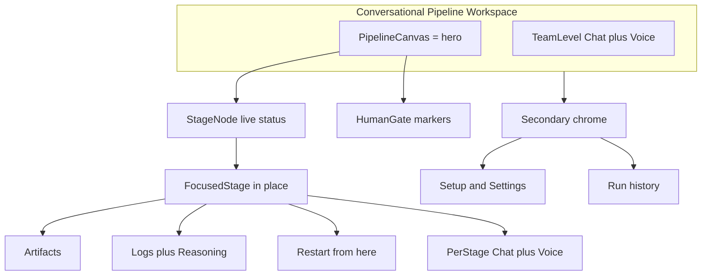

# Design Brief: Conversational Pipeline Workspace (Figma-Agentic)

**Task:** [TASK-008](../.tasks/BACKLOG.md)
**Audience:** Designer (human or AI, via the Figma Agent)
**Status:** Open — ready to generate in Figma
**Primary artifact:** [figma-agent-prompt.md](figma-agent-prompt.md) (paste-ready Figma Agent prompt)

---

## Goal

Design the ADHD desktop workspace as a **UI + speaking interface for directing an AI development
team** across the full delivery lifecycle. The design is generated **agentically in Figma**: a
prompt produces several visual directions, one is chosen, and it **replaces** the earlier
desktop-shell direction. The design system is proposed **fresh** by the Agent (not carried over from
the current prototype).

The current prototype ([`packages/ui/src/App.tsx`](../packages/ui/src/App.tsx)) uses a large hero
header with marketing copy — the explicit **anti-pattern** to remove.

---

## Positioning

ADHD sits **between two poles**, and the UI should read that way:

| Pole | What it contributes to our UX | What we deliberately don't take |
|------|-------------------------------|----------------------------------|
| **n8n** (automation graph) | A visible, inspectable pipeline of discrete stages | Free-form node authoring / arbitrary DAG editing |
| **Lovable** (conversational build) | Talk to the system; agent autonomy; steer by chat/voice | A live app-preview panel (our output can be anything) |

**Complementary, not competitive — Claude Code Dynamic Workflows.** Claude's dynamic workflows build
a task structure at runtime and fan out to many subagents, auditable in the Console. ADHD is the
*governance shell one level up*: predefined, human-gated lifecycle stages. A dynamic-workflow run can
even power the **implementation** stage via the harness adapter. We borrow the Console's *run/subagent
inspection* feel for the focused-stage view — not its runtime-emergent structure.

---

## Concept: Conversational Pipeline Workspace

- **The pipeline canvas is the hero surface** — and it *is* the stage/run view. There is no separate
  "inspector." Selecting a stage **focuses it in place**.
- **Stages are specialists you can talk to.** Each node is a team member (Requirements, Design,
  Implementation, Review, Test, Release, Deploy). Conversational + voice steering is scoped to a stage
  ("talk to this specialist") **and** to the whole pipeline ("talk to the team"). Two scopes.
- **Voice is first-class.** Design mic / push-to-talk affordances and their states, not a bolt-on.
- **No live app preview.** The built product can be anything; we show artifacts, logs, and reasoning.
- **Single fixed pipeline, adjustable by setup.** Stages come from a **predefined catalog**; users
  toggle which are active and configure gates/harness/keys/deploy — they do **not** author nodes.
- Navigation and settings are **secondary chrome**; the canvas + steering own the frame.

---

## Surfaces to design

| Surface | Purpose | Priority |
|---------|---------|----------|
| **Pipeline canvas** (= stage/run view) | Fixed stages as live-status nodes + gate markers; the hero | High |
| **Focused stage** | In place: artifacts, log stream, agent reasoning, restart-from-here, per-stage steering | High |
| **Pipeline-level steering** | Chat + voice controller: start/steer run, approve gates, ask status | High |
| **Setup** | Toggle predefined stages; configure gates, harness (Claude Code / Cursor), model keys, deploy target | Medium |
| **Human gates** | Approve / reject at requirements, design, release, deploy | Medium |
| **Run history** | Past runs; restart-from-stage | Medium |
| **Empty / first-run** | Before any task or run exists | Medium |

---

## Design system (fresh, Agent-proposed)

The Figma Agent proposes the palette, type scale, spacing, radii, and elevation from scratch — dense,
IDE-adjacent, professional. It is **not** bound to the prototype's slate colors. Whatever it proposes
must give a **distinct, accessible token** to every state value below (source:
[technical-architecture.md](technical-architecture.md)).

| Group | Values |
|-------|--------|
| **Stage status** | pending · running · passed · failed · awaiting-approval · skipped |
| **Run status** | pending · running · paused · completed · failed · cancelled |
| **Gate** | awaiting · approved · rejected |
| **Voice** | idle · listening · transcribing · speaking |

Deliver tokens as Figma variables/styles so engineering can map them to `packages/ui`.

---

## Figma-agentic workflow

1. Paste [figma-agent-prompt.md](figma-agent-prompt.md) into the Figma Agent.
2. Generate **3 distinct directions**; iterate on the strongest with follow-up prompts.
3. Extract that direction's tokens into Figma variables/styles.
4. **Replace** the old desktop-shell direction with the chosen one; record it as the design of record.

**Optional future (not required now):** encode this brief's design system + states as a **Figma Make
Skill**; wire the **`use_figma` MCP server** so Claude Code can round-trip frames into `packages/ui`.

---

## Constraints

- **Desktop-first** (1280px+) with a **narrow 960px** adaptation that keeps density; must work in the
  browser (localhost) and later inside a **Tauri** shell without layout change
  ([technical-architecture.md](technical-architecture.md)).
- **Real-time via SSE** — status, logs, and voice/transcription surfaces update live without reload.
- The pipeline canvas is currently a hand-rolled SVG chart (React Flow was skipped —
  [prototype-plan.md](prototype-plan.md)). A richer canvas (pan/zoom, node focus, per-node chat) may
  justify revisiting that; treat it as an **implementation** decision, out of scope here.
- No CSS framework is locked in.

---

## Designer deliverables

1. **Figma Agent prompt** — [figma-agent-prompt.md](figma-agent-prompt.md), refined as needed.
2. **3 generated directions** in Figma; one selected to replace the old design.
3. **Fresh design system** — color / type / spacing / status + gate + voice tokens as styles/variables.
4. **Primary screens** — pipeline canvas (several live-status combinations), focused stage
   (artifacts / logs / reasoning + per-stage steering), pipeline-level steering, setup/settings,
   human-gate approve/reject, run history/restart, empty state.
5. **Voice affordance spec** — mic / push-to-talk control and idle/listening/transcribing/speaking states.
6. **Engineer handoff notes** — layout grid, spacing tokens, interaction states; map to `packages/ui`;
   SSE live-update behavior; Tauri + browser parity (no implementation in this task).

---

## Out of scope

- Free-form / drag-to-author DAG editing (v0.2 visual workflow editor).
- Live app-preview panel.
- Figma Make Skills and `use_figma` MCP code round-trip (optional future).
- Real harness/voice wiring, Tauri vs Electron implementation choice, brand/marketing site,
  Playwright/deploy adapter UI.
