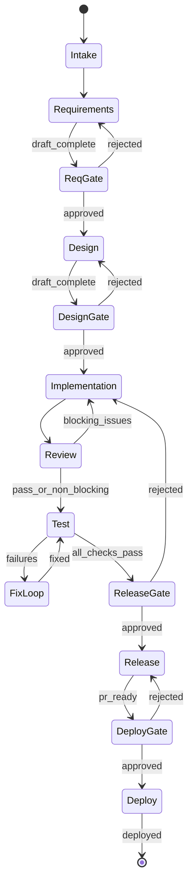

# MVP Scope: ADHD

**Version:** 0.1 (smallest useful product)  
**Goal:** One developer can take a single feature from idea to deployed preview on their local machine, with visible stages, restartable steps, Playwright E2E verification, at least one deploy adapter, and at least one coding harness adapter.

---

## In Scope

### Input formats (v0.1)

| Format | Example | Parser behavior |
|--------|---------|-----------------|
| **Built-in task** | `adhd run --task TASK-001` | Loads task from `.adhd/tasks/`; links run to task |
| **Plain text idea** | `adhd run "Add user login with email OTP"` | Creates run from string |
| **Markdown file** | `.adhd/inputs/feature.md` | Loads title, body, optional acceptance criteria |
| **GitHub issue URL** | `adhd run --issue https://github.com/org/repo/issues/42` | Fetches title + body via `gh` CLI (optional dep) |

**Not in v0.1:** Linear, Jira, design-tool import (adapter hooks only).

---

### Built-in task management (v0.1)

Repo-native backlog stored under `.adhd/tasks/` in the target repo. Tasks are the persistent planning layer; runs are the execution unit. A task can spawn one or more runs over time (e.g. initial implementation, then a follow-up iteration).

**Task model:**

| Field | Description |
|-------|-------------|
| `id` | Auto-generated (e.g. `TASK-001`) |
| `title` | Short summary |
| `description` | Markdown body, acceptance criteria |
| `status` | `backlog` \| `ready` \| `in_progress` \| `blocked` \| `done` \| `rejected` |
| `priority` | `P0`–`P4` (P0 critical, P4 wishlist) |
| `tags` | Optional comma-separated labels |
| `runIds` | Links to associated lifecycle runs |

**Storage:**

```
.adhd/
  tasks/
    index.json              # machine-readable summaries for fast listing
    TASK-001.md             # human-readable task detail + run history
    TASK-002.md
```

**CLI commands:**

| Command | Behavior |
|---------|----------|
| `adhd task create` | Create task (interactive or `--title`, `--description`) |
| `adhd task list` | List tasks; filter by `--status`, `--priority`, `--tag` |
| `adhd task show <id>` | Full task detail |
| `adhd task move <id> --status <status>` | Change task status |
| `adhd task update <id>` | Update title, description, priority, tags |
| `adhd run --task <id>` | Start lifecycle run from task; sets `taskId` on run |

**Dashboard controls (tasks):**

| Control | Behavior |
|---------|----------|
| **Task list / backlog** | All tasks with status badge, priority, tags |
| **Task detail** | View/edit description, acceptance criteria, linked runs |
| **Status change** | Move task between backlog, ready, in progress, etc. |
| **Start run from task** | Primary action — creates run, links to task, opens run timeline |

**Deferred to v0.2:** External sync (Linear, GitHub issues), sprint planning, team collaboration, task dependencies.

---

### Workflow stages (fixed default pipeline)



| # | Stage ID | Agent | Max retries | Human gate |
|---|----------|-------|-------------|------------|
| 0 | `intake` | Intake normalizer | 1 | No |
| 1 | `requirements` | Requirements agent | 2 | Yes (approve spec) |
| 2 | `design` | Design agent | 2 | Yes (approve design) |
| 3 | `implementation` | Implementation agent (harness) | 3 | No |
| 4 | `review` | Review agent (blind) | 2 | No (auto-block on critical) |
| 5 | `test` | Test agent + fixer loop (unit + Playwright E2E) | 5 | No |
| 6 | `release` | Release agent | 1 | Yes (approve PR) |
| 7 | `deploy` | Deploy agent (platform adapter) | 2 | Yes (approve deploy) |

**Stage restart:** `adhd restart <run-id> --from <stage-id>` re-runs from that stage forward, reusing prior artifacts unless `--fresh`.

---

### Artifacts (per run)

Stored under `.adhd/runs/<run-id>/` in the target repo:

```
.adhd/
  config.yaml                 # project defaults, harness, gates
  tasks/
    index.json                # task summaries for listing
    TASK-001.md               # task detail (title, description, run links)
  runs/
    <run-id>/
      state.json              # machine-readable run state
      events.jsonl            # append-only audit log
      intake/
        raw-input.md
      requirements/
        requirements.md
        open-questions.md
      design/
        design.md
        architecture.mmd      # optional Mermaid
        mockup-plan.md        # text description + refs to images
      implementation/
        harness-log.txt
        worktree-path.txt
        notes.md
      review/
        review-report.md
        verdict.json          # pass | fail | pass_with_notes
      test/
        results.json
        coverage.txt
        e2e-report.json       # Playwright results
        e2e-traces/           # optional trace artifacts
      release/
        pr-body.md
        changelog.md
        checklist.md
      deploy/
        deploy-log.txt
        deploy-url.txt
        rollback-notes.md
```

**Git policy:** Spec artifacts (`requirements`, `design`) may be committed to a `specs/<feature-slug>/` path on user approval. Code changes live on branch `adhd/<slug>-<run-id>` in an isolated worktree.

---

### Deploy adapters (v0.1)

| Adapter | Priority | Invocation | Status |
|---------|----------|------------|--------|
| **Generic subprocess** | P0 | User-defined deploy command in config | Ship first |
| **Docker Compose** | P0 | `docker compose up -d --build` in worktree | Ship first |
| **Vercel CLI** | P1 | `vercel deploy --prebuilt` or project-linked deploy | Ship if `vercel` present |
| **Netlify CLI** | P2 | `netlify deploy --prod` | Post-MVP |
| **Fly.io / Railway** | P2 | Platform CLI wrapper | Post-MVP |

**Deploy adapter contract (minimal):**

```typescript
interface DeployAdapter {
  id: string;
  deploy(ctx: DeployContext): Promise<DeployResult>;
}

interface DeployContext {
  worktreePath: string;
  releaseArtifacts: Record<string, string>;
  environment: "preview" | "production";
  timeoutMs: number;
}

interface DeployResult {
  success: boolean;
  url?: string;
  stdout: string;
  stderr: string;
  exitCode: number;
}
```

**MVP policy:** Deploy targets **preview/staging** by default. Production deploy requires explicit `--env production` or config flag plus human gate approval.

---

### Harness adapters (v0.1)

| Adapter | Priority | Invocation | Status |
|---------|----------|------------|--------|
| **Claude Code CLI** | P0 | `claude -p "<prompt>"` in worktree | Ship first |
| **Cursor Agent CLI** | P0 | `cursor agent` or headless API if available | Ship first |
| **Generic subprocess** | P0 | User-defined command + env in config | Fallback |
| **OpenHands** | P1 | SDK or CLI wrapper | Stub in v0.1 |
| **Aider** | P2 | `aider --message` | Post-MVP |

**Adapter contract (minimal):**

```typescript
interface HarnessAdapter {
  id: string;
  run(ctx: HarnessContext): Promise<HarnessResult>;
}

interface HarnessContext {
  worktreePath: string;
  prompt: string;
  artifacts: Record<string, string>; // paths to requirements, design, etc.
  timeoutMs: number;
}

interface HarnessResult {
  success: boolean;
  stdout: string;
  stderr: string;
  filesChanged: string[];
  exitCode: number;
}
```

---

### Dashboard controls (v0.1)

**Delivery:** Local web UI at `http://localhost:9477` (default port), started via `adhd ui` or auto-started on `adhd run`.

| Control | Behavior |
|---------|----------|
| **Task list / backlog** | All tasks with status, priority, tags; filter by status |
| **Task detail** | View/edit description, linked runs; start run from task |
| **Run list** | All runs for current repo, status badge, started/completed time |
| **Stage timeline** | Vertical stepper: pending / running / passed / failed / awaiting_approval |
| **Artifact viewer** | Render markdown artifacts; link to files on disk |
| **Live logs** | Tail `events.jsonl` and harness stdout via SSE |
| **Approve / Reject** | At human gates; reject returns to prior stage with comment |
| **Restart stage** | Button triggers `restart --from <stage>` |
| **Cancel run** | Stops current agent subprocess; preserves worktree for inspection |
| **Cost summary** | Token/cost estimates if harness reports them (optional) |

**CLI parity:** Every dashboard action available as CLI subcommand for scripting.

---

### Quality gates (v0.1)

| Gate | Type | Rule |
|------|------|------|
| Requirements complete | Soft | No unresolved `[NEEDS CLARIFICATION]` markers |
| Design complete | Soft | Contains data model or explicitly N/A |
| Review critical | Hard | Zero `severity: critical` findings |
| Tests (unit) | Hard | Configured `test` command exits 0 |
| Tests (E2E) | Hard | Playwright suite exits 0 (or configured E2E runner) |
| Lint (optional) | Soft | Configurable in `config.yaml` |
| Build (optional) | Soft | Configurable in `config.yaml` |

### Testing (v0.1)

The test stage runs **two layers**:

1. **Unit/integration** — project-configured command (`npm test`, `pytest`, etc.)
2. **E2E browser** — Playwright by default (`npx playwright test`)

Playwright integration:

- Test agent can invoke Playwright Test Agents (planner → generator → healer) or run existing specs
- On E2E failure: fix loop returns to implementation harness with `e2e-report.json` + traces
- App must be reachable at `e2eBaseUrl` (dev server started by test agent or pre-started in config)

Project declares validation in `.adhd/config.yaml`:

```yaml
validation:
  test: npm test
  lint: npm run lint
  build: npm run build
  e2e: npx playwright test
  e2eBaseUrl: http://localhost:3000
  e2eStartServer: npm run dev   # optional; agent waits for URL

deploy:
  default: docker-compose
  adapters:
    docker-compose:
      type: subprocess
      command: docker compose up -d --build
    vercel:
      type: vercel
      command: vercel
      args: ["deploy"]
  environment: preview
```

---

## Out of Scope (v0.1)

- Visual workflow editor (drag-and-drop nodes)
- Multi-repo orchestration
- Cloud sync or team collaboration
- Built-in mockup image generation (text plan only; user attaches images to input)
- Production deploy without explicit opt-in and human gate
- Custom agent authoring UI (edit prompt files in `.adhd/agents/` instead)
- Windows-native installer (CLI + `npx` or `pipx` sufficient)
- External task sync (Linear, Jira, GitHub issues) — adapter hooks only
- Sprint planning, task dependencies, team collaboration

---

## User stories (acceptance)

1. **As a developer**, I run `adhd run "Add dark mode toggle"` and see eight stages progress in the dashboard.
2. **As a developer**, I reject the design gate, edit `design.md`, and restart from design without re-running requirements.
3. **As a developer**, I configure Claude Code as harness and see implementation happen in an isolated git worktree.
4. **As a developer**, Playwright E2E runs in the test stage and failures trigger a fix loop back to implementation.
5. **As a developer**, I approve release and get a draft PR; after approving deploy, I get a reachable preview URL.
6. **As a developer**, I inspect `events.jsonl` to audit what each agent did.
7. **As a developer**, I create a task in the backlog, move it to ready, and start a run from it; the run links back to the task and I see run progress from the task detail view.

---

## MVP delivery checklist

- [ ] CLI: `init`, `run`, `status`, `restart`, `approve`, `reject`, `ui`
- [ ] CLI: `task create`, `task list`, `task show`, `task move`, `task update`; `run --task <id>`
- [ ] Built-in task management: CRUD, status, link runs to tasks
- [ ] Default 8-stage pipeline with state machine (incl. deploy)
- [ ] Aiki-backed durable workflow runtime (or thin fallback state machine)
- [ ] Worktree isolation per run
- [ ] 2 harness adapters (Claude Code + generic)
- [ ] Playwright E2E in test stage with fix loop
- [ ] 1 deploy adapter (Docker Compose or generic subprocess)
- [ ] Local dashboard with task backlog + run timeline + logs
- [ ] Example repo + sample run documented in README

---

## Post-MVP (v0.2 candidates)

- Visual workflow editor (edit stage order, add/remove stages)
- OpenHands + Aider adapters
- Additional deploy adapters (Netlify, Fly.io, Railway)
- Linear / GitHub issue native sync (task import/export)
- Team workflow templates (shareable YAML)
- Mockup stage with wireframe tool integration (Excalidraw, design-tool MCP)
