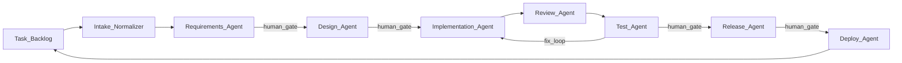

# Product Brief: Isotopy

**Product name:** Isotopy

**Tagline:** The last mile for your ideas — turning them into working businesses.

**One-liner:** An open-source, local AI development team that turns ideas into working products, tests them end-to-end, deploys them anywhere, and keeps them evolving with prepared agents and your choice of coding tools.

---

## Problem

Developers increasingly use AI agents (Cursor, Claude Code, OpenHands) to write code, but each session is isolated:

- Requirements live in chat, not in the repo
- Design decisions are lost when the window closes
- Implementation, review, testing, and deployment are manual handoffs
- Failed steps mean starting over or untangling mixed context
- No single view of where a feature is in its lifecycle
- Ideas and backlog items scatter across chat, sticky notes, and external PM tools with no link to execution

**App builders solve the wrong half of the problem.** Hosted prompt-to-app builders and similar tools are excellent at getting from prompt to first version. Users report that further development becomes hard and unpredictable: small changes have side effects, debugging loops burn credits, architecture doesn't scale, and hosted backends create lock-in even when you own the frontend code.

**There is no open-source, local product that combines fast first-version generation with durable ongoing development** — explicit context, restartable stages, repo-native artifacts, E2E verification, and deploy-to-any-platform — while staying model-agnostic and harness-agnostic.

---

## Solution

A **local-first AI app builder and evolution workflow**: predefined, editable stages; each stage runs a specialized subagent; artifacts and state live in git; any stage can be restarted independently; implementation delegates to Claude Code, Cursor, Codex, or other adapters; testing includes Playwright E2E; deployment uses pluggable platform adapters.

**Built-in task management** provides a repo-native backlog layer — capture ideas, prioritize work, and start lifecycle runs from tasks without a separate PM tool or IDE extension. Tasks feed the intake stage; runs remain the execution unit for the full pipeline.

> Fast first version — then built for v2, v3, and everything after. Opinionated stages, auditable runs, your models, your infrastructure.

---

## The App Builder Gap (Our Wedge)

| Phase | Hosted app builders | Isotopy |
|-------|------------------------|----------------------|
| First version | Fast, impressive demos | Comparable speed with prepared agents |
| Iteration 2+ | Unpredictable side effects, debug loops | Restartable stages, explicit artifacts |
| Context | Lives in platform session | Lives in repo (specs, design, history) |
| Testing | Basic or manual | Unit + Playwright E2E with fix loops |
| Deployment | Platform-hosted (vendor cloud, managed backend) | Adapter-based: Vercel, Docker, any CLI |
| Models | Platform-chosen | BYOK — OpenAI, Anthropic, Ollama, etc. |
| Ownership | Export code, lose infra context | Full local control, git-native audit trail |

**Tradeoff we accept:** users must provide richer context (acceptance criteria, project constraints, existing codebase). **What we provide:** agents are already set up for each stage — requirements, design, implementation, review, test, release, deploy — and workflows are adjustable without rebuilding from scratch.

---

## Target User

**Primary (MVP):** Solo developers and small teams (1-5) who want prompt-to-app speed but need a product they can keep building after launch — locally, with their models, on their stack.

**Secondary:** Agencies shipping client projects with consistent process; technical founders who outgrew a hosted app builder but don't want to lose AI-assisted velocity.

**Not targeting (v1):** Non-technical users seeking zero-context one-click apps; enterprise teams needing SSO, RBAC, and multi-tenant cloud (future).

---

## Core Workflow

**Input paths:** Tasks from the built-in backlog (`isotopy task create`, dashboard), plain text (`isotopy run "..."`), markdown files, or GitHub issue URLs. All paths normalize through the intake stage before requirements.

| Stage | Agent role | Primary outputs |
|-------|------------|-----------------|
| **Requirements** | Clarify scope, acceptance criteria, risks | requirements.md, open questions |
| **Design** | Architecture, data model, UI/mockup plan, test strategy | design.md, diagrams, wireframe refs |
| **Implementation** | Code in isolated worktree via harness adapter | Branch, commits, implementation notes |
| **Review** | Independent diff review vs requirements | Review report, blocking issues |
| **Test** | Unit checks + Playwright E2E, generate/fix tests | Test results, E2E report, coverage |
| **Release** | PR, changelog, deploy checklist | PR URL or release package |
| **Deploy** | Platform adapter execution | Deploy URL, logs, rollback notes |

Human approval gates after Requirements, Design, Release, and before Deploy (configurable).

---

## Differentiation

| Dimension | Hosted app builders | Local OSS builders (Dyad, Singulary) | Us |
|-----------|------------------------|--------------------------------------|-----|
| Runs locally | Rarely | Yes | Yes |
| Open source | No | Yes | Yes |
| Arbitrary repo/stack | No | Partial | Yes |
| Ongoing evolution (v2+) | Weak | Chat-based, limited stages | Stage restart + artifacts |
| Workflow stages visible and editable | No | Partial | Yes |
| Use existing harness (Cursor, etc.) | No | Partial | Yes |
| Playwright E2E in pipeline | Rare | Some (Locode) | Yes |
| Deploy to any platform | Platform lock-in | Export / limited | Adapter-based |
| Artifacts in git | Sometimes | Varies | Yes |
| Visual run dashboard | Yes | Varies | Yes (MVP) |
| Built-in task backlog | No | No | Yes (repo-native, feeds runs) |

**Positioning statement:**

> For developers who liked hosted app-builder speed but hit a wall on iteration, Isotopy is the open-source local alternative that builds the first version and keeps the project evolvable — with prepared agents, Playwright E2E, deploy-anywhere adapters, and restartable stages — without replacing Cursor or Claude Code.

---

## Value Proposition

1. **First version + forever** — Same workflow for greenfield and iteration 50.
2. **Control** — Edit stages, swap models and harnesses, approve before code ships or deploys.
3. **Auditability** — State file plus git history show what each agent did and why.
4. **Speed with guardrails** — Automation where safe; human gates where judgment matters.
5. **No lock-in** — Markdown specs, standard git, pluggable agents, your deployment target.
6. **Persistent backlog** — Tasks live in the repo (`.isotopy/tasks/`), link to runs, and survive across sessions — not a separate Jira clone, but intake that feeds the pipeline.

---

## Success Metrics (MVP)

| Metric | Target |
|--------|--------|
| Time to first end-to-end run (idea to deployed preview) | Under 2 hours setup plus 1 feature |
| Stage restart without full rerun | Works for all stages |
| Harness adapters shipped | At least 2 (e.g. Claude Code plus Cursor CLI) |
| Playwright E2E runs in test stage | At least one green path per sample app |
| Deploy adapter produces reachable URL | At least 1 (Vercel, Docker, or generic CLI) |
| User completes run without editing orchestrator code | At least 80% of beta users |

---

## Risks and Mitigations

| Risk | Mitigation |
|------|------------|
| Harness APIs unstable | Adapter interface plus CLI fallback |
| Scope creep vs hosted builders on v1 speed | Prepared agents + templates; don't host runtime |
| Orchestration complexity | OpenWorkflow for durable execution (embedded SQLite, no server); fixed default pipeline |
| Quality of agent output | Gates, blind review agent, Playwright E2E fix loops |
| Context burden on user | Smart defaults, intake agent, progressive disclosure |
| Task management scope creep | Tasks feed runs only; no sprint planning, team sync, or external PM in MVP |

---

## Business Model (Future)

- **OSS core** (CLI plus local runner plus default workflow)
- **Pro:** visual workflow editor, team templates, cost analytics, priority deploy adapters
- **Not in scope for MVP**

---

## Next Steps

1. Implement architecture with the OpenWorkflow workflow runtime (see [architecture.md](architecture.md))
2. Validate with 3-5 developers running one real feature end-to-end including deploy
3. Publish docs and open-source repo under Isotopy
