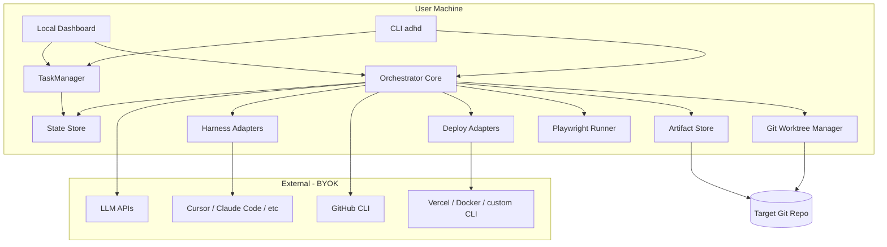
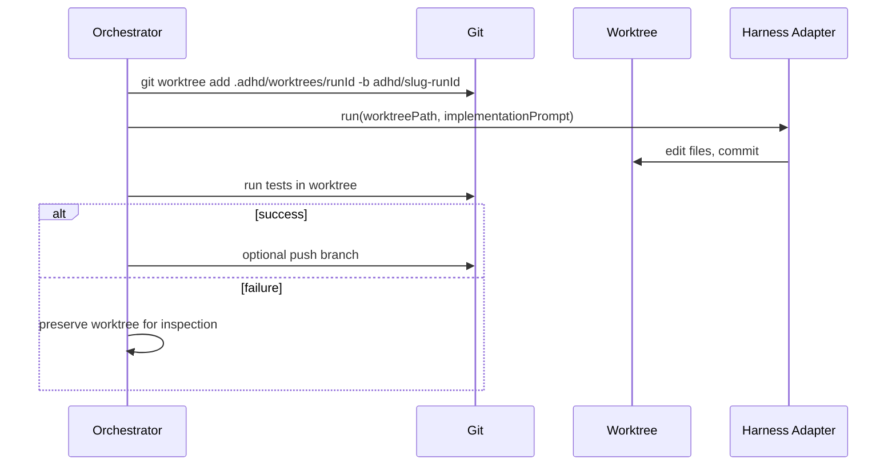
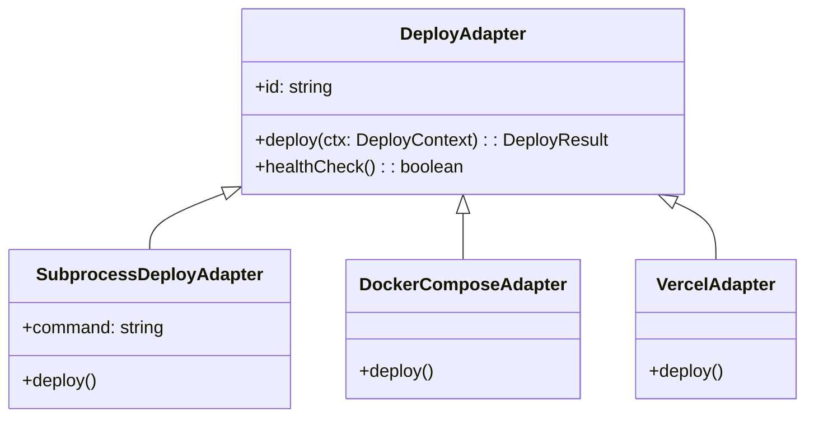
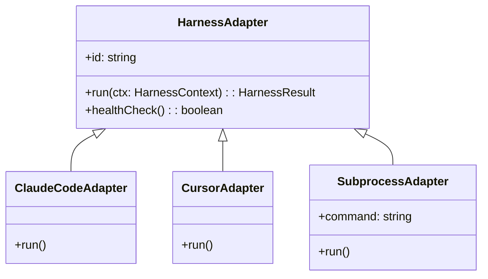

# Technical Architecture: ADHD

**Version:** 0.1 draft  
**Stack recommendation:** TypeScript (CLI + API + UI) on Node.js; pnpm workspaces monorepo; Hono API; React/Vite dashboard; file-based persistence. Python acceptable for agent subprocess glue. Optional future Tauri desktop shell — not MVP.

---

## System context



---

## Core components

### 1. Orchestrator

Central state machine. Responsibilities:

- Load workflow definition (default pipeline YAML)
- Transition stages based on agent output and gate results
- Spawn stage agents (LLM-backed or harness-backed)
- Emit events to `events.jsonl`
- Handle pause at human gates
- Implement restart semantics (partial re-run)

**Key modules:**

| Module | Responsibility |
|--------|----------------|
| `WorkflowEngine` | Parse pipeline, validate transitions |
| `RunController` | CRUD for runs, cancel, restart |
| `TaskManager` | CRUD for tasks, status, link runs to tasks |
| `StageExecutor` | Invoke agent for one stage |
| `GateEvaluator` | Run soft/hard gates on artifacts |
| `EventBus` | Internal pub/sub; fan-out to UI SSE |

### 2. Task management

**TaskManager** handles repo-native backlog items. Tasks are independent of run state; a task can spawn multiple runs over time.

**Storage:**

| File | Purpose |
|------|---------|
| `.adhd/tasks/index.json` | Machine-readable summaries for fast listing and filtering |
| `.adhd/tasks/<task-id>.md` | Human-readable detail: title, description, acceptance criteria, run history |

**index.json shape:**

```json
{
  "nextId": 2,
  "idPrefix": "TASK",
  "tasks": [
    {
      "id": "TASK-001",
      "title": "Add dark mode toggle",
      "status": "in_progress",
      "priority": "P1",
      "tags": ["ui", "accessibility"],
      "runIds": ["a1b2c3"],
      "createdAt": "2026-06-28T09:00:00Z",
      "updatedAt": "2026-06-28T10:00:00Z"
    }
  ]
}
```

**Task statuses:** `backlog` | `ready` | `in_progress` | `blocked` | `done` | `rejected`

**Task markdown format** (`.adhd/tasks/TASK-001.md`):

```markdown
# TASK-001: Add dark mode toggle

**Status:** in_progress | **Priority:** P1 | **Tags:** ui, accessibility

## Description

User-toggleable dark mode with system preference detection.

## Acceptance criteria

- Toggle in settings persists across sessions
- Respects `prefers-color-scheme` when set to "system"

## Runs

- a1b2c3 (running) — started 2026-06-28
```

**Run linkage:** `state.json` gains optional `taskId`:

```json
{
  "runId": "a1b2c3",
  "taskId": "TASK-001",
  "slug": "dark-mode-toggle",
  ...
}
```

When a run completes or fails, TaskManager can update task status (configurable; default: manual).

### 3. Workflow state

**File:** `.adhd/runs/<run-id>/state.json`

```json
{
  "runId": "a1b2c3",
  "taskId": "TASK-001",
  "slug": "dark-mode-toggle",
  "status": "running",
  "currentStage": "implementation",
  "inputRef": "intake/raw-input.md",
  "worktree": {
    "path": ".adhd/worktrees/a1b2c3",
    "branch": "adhd/dark-mode-toggle-a1b2c3",
    "baseBranch": "main"
  },
  "stages": {
    "requirements": {
      "status": "passed",
      "startedAt": "2026-06-28T10:00:00Z",
      "completedAt": "2026-06-28T10:05:00Z",
      "attempts": 1,
      "artifacts": ["requirements/requirements.md"]
    },
    "design": {
      "status": "awaiting_approval",
      "startedAt": "2026-06-28T10:05:30Z",
      "attempts": 1,
      "artifacts": ["design/design.md"]
    }
  },
  "gates": {
    "req_gate": { "status": "approved", "approvedBy": "human", "at": "..." }
  },
  "harness": "claude-code",
  "cost": { "inputTokens": 0, "outputTokens": 0, "usd": 0 }
}
```

**Stage statuses:** `pending` | `running` | `passed` | `failed` | `awaiting_approval` | `skipped`

**Run statuses:** `pending` | `running` | `paused` | `completed` | `failed` | `cancelled`

### 4. Event log (audit trail)

**File:** `.adhd/runs/<run-id>/events.jsonl`

One JSON object per line:

```json
{"ts":"2026-06-28T10:00:01Z","type":"stage.started","stage":"requirements","runId":"a1b2c3"}
{"ts":"2026-06-28T10:05:00Z","type":"stage.completed","stage":"requirements","verdict":"pass"}
{"ts":"2026-06-28T10:05:01Z","type":"gate.awaiting","gate":"req_gate"}
{"ts":"2026-06-28T10:06:00Z","type":"gate.approved","gate":"req_gate","actor":"human"}
```

Enables dashboard live tail and post-run forensics.

---

## Workflow runtime (Aiki)

**Recommendation:** Use [Aiki](https://github.com/aikirun/aiki) as the durable workflow execution layer. Do **not** build custom crash recovery, retry, and long-running suspend/resume from scratch unless Aiki cannot be embedded in the local single-process MVP.

**Why Aiki:**

| Need | Aiki capability |
|------|-----------------|
| Long-running agent runs | Durable execution with checkpoint/resume |
| Human approval gates | Typed event suspension until approve/reject |
| Stage retries | Configurable retry policies per task |
| Crash recovery | Worker failover; run resumes from last checkpoint |
| Workflow versioning | Ship new pipeline YAML without breaking in-flight runs |
| Local-first | Runs in-process or split topology; no cloud required |

**Layering:**

```
┌─────────────────────────────────────────┐
│  ADHD domain layer      │
│  stages, agents, artifacts, gates,      │
│  worktrees, harness + deploy adapters   │
├─────────────────────────────────────────┤
│  Aiki workflow runtime                  │
│  durable steps, events, retries, sleep  │
└─────────────────────────────────────────┘
```

Each pipeline stage maps to an Aiki workflow (or child workflow). Human gates map to `waitForEvent("gate.approved")`. Harness and deploy invocations map to Aiki tasks with timeouts and retries.

**Fallback:** If Aiki embedding proves too heavy for v0.1 packaging, ship a minimal custom state machine (`state.json` + `events.jsonl`) but design the `StageExecutor` interface to swap to Aiki in v0.2 without changing adapter contracts.


---

## Git worktree isolation

Pattern borrowed from Sikula and AI-SDLC.



**Rules:**

- Worktree created before `implementation` stage (or at run start if config says so)
- Base branch from config (`main` default)
- Dirty tracked files on base branch: block run with clear error (like Sikula)
- On cancel: worktree preserved; on success: worktree removed, branch kept
- `restart --from implementation`: reuse existing worktree if present

---

## Agent model

Two agent kinds:

### LLM stage agents (requirements, design, review, release, deploy)

- Prompt templates in `.adhd/agents/<stage>.md`
- Context injected: prior artifacts, project `AGENTS.md`, `.adhd/context/*`
- Provider via LiteLLM or direct API (Anthropic, OpenAI, Ollama)
- Output written to stage artifact paths; parsed for gate checks

### Harness agent (implementation)

- Delegates to `HarnessAdapter`
- Prompt built from `requirements.md` + `design.md` + implementation template
- Does not share chain-of-thought with review agent (blind review)

**Blind review rule:** Review agent receives task description, requirements, design summary, and `git diff` only — not implementation agent logs.

### Test agent (unit + Playwright E2E)

- Runs configured unit/integration command in worktree
- Runs Playwright E2E (`npx playwright test` default)
- Optionally starts dev server via `e2eStartServer` config before E2E
- On failure: emits `e2e-report.json`, optional trace paths; triggers fix loop to implementation harness
- Can use Playwright Test Agents (planner/generator/healer) to bootstrap specs for greenfield apps

---

## Deploy adapter layer



**Registration:** `config.yaml`:

```yaml
deploy:
  default: docker-compose
  environment: preview
  adapters:
    docker-compose:
      type: subprocess
      command: docker compose up -d --build
      cwd: worktree
    vercel:
      type: vercel
      command: vercel
      args: ["deploy"]
```

Deploy stage runs after release gate approval. Production deploy requires explicit config + human gate.

---

## Harness adapter layer

For when to use Claude Code vs Cursor and stage-to-tool mapping, see [model-and-harness-strategy.md](model-and-harness-strategy.md).



**Registration:** `config.yaml`:

```yaml
harness:
  default: claude-code
  adapters:
    claude-code:
      type: claude-code
      command: claude
      timeoutMs: 1800000
    cursor:
      type: cursor
      command: cursor
      args: ["agent"]
```

**SubprocessAdapter** allows power users to wire any CLI without code changes.

---

## Restart and resume semantics

| Command | Behavior |
|---------|----------|
| `adhd run` (new) | New `runId`, fresh state |
| `adhd resume <runId>` | Continue from `currentStage` if paused/failed |
| `adhd restart <runId> --from <stage>` | Mark stage and all downstream as `pending`; keep upstream artifacts |
| `adhd restart <runId> --from <stage> --fresh` | Delete downstream artifacts; re-run stage from scratch |

**Implementation detail:** Restart invalidates stage entries in `state.json` from the target stage forward; does not delete upstream artifact files (unless `--fresh`).

---

## Artifact storage strategy

| Artifact type | Location | Git tracked? |
|---------------|----------|--------------|
| Tasks | `.adhd/tasks/` | Optional (gitignore by default) |
| Run state, events | `.adhd/runs/` | Optional (gitignore by default) |
| Approved specs | `specs/<slug>/` | Yes (on user opt-in) |
| Code changes | `adhd/*` branch | Yes (normal git) |
| Agent prompts | `.adhd/agents/` | Yes (team customization) |
| Project context | `.adhd/context/` | Yes |

**Principle:** Machine state is local and reproducible; human-approved artifacts promote into tracked repo paths.

---

## Local dashboard architecture

```
┌─────────────────────────────────────────┐
│  React/Vite SPA (localhost:9477)        │
│  - Task backlog / list                  │
│  - Run list + stage timeline            │
├─────────────────────────────────────────┤
│  REST API (Hono)                        │
│  Tasks:                                 │
│  - GET /tasks, POST /tasks              │
│  - GET /tasks/:id, PATCH /tasks/:id     │
│  - POST /tasks/:id/runs (start run)     │
│  Runs:                                  │
│  - GET /runs, GET /runs/:id             │
│  - POST /runs/:id/approve, /reject      │
│  - POST /runs/:id/restart               │
│  - GET /runs/:id/events (SSE)           │
├─────────────────────────────────────────┤
│  Orchestrator + TaskManager (in-process)│
└─────────────────────────────────────────┘
```

Single binary or `adhd ui` spawns API + static UI. No external database — reads `index.json`, task markdown, `state.json`, and `events.jsonl` directly.

**Packaging note:** MVP uses local server + Web UI. A future Tauri desktop app can wrap the same Hono API and Vite SPA without changing orchestrator design.

---

## Default pipeline definition

**File:** `.adhd/workflows/default.yaml`

```yaml
id: default
version: 1
stages:
  - id: intake
    agent: intake
    gates: []
  - id: requirements
    agent: requirements
    gates: [req_complete]
    humanGate: req_gate
  - id: design
    agent: design
    gates: [design_complete]
    humanGate: design_gate
  - id: implementation
    agent: implementation
    harness: true
    gates: []
  - id: review
    agent: review
    gates: [no_critical_findings]
  - id: test
    agent: test
    gates: [tests_pass]
    onFail: fix_loop
  - id: release
    agent: release
    gates: []
    humanGate: release_gate
  - id: deploy
    agent: deploy
    gates: [deploy_success]
    humanGate: deploy_gate
```

Custom workflows: copy YAML, edit stage list (v0.2 visual editor).

---

## Security considerations

- All execution local; API keys from env or OS keychain
- Harness runs in worktree only; no arbitrary path write
- Subprocess adapter: allowlist or explicit user confirmation for custom commands
- No telemetry by default
- Secrets scanner in review stage (optional gate)

---

## Repository layout (implementation)

```
adhd/
  packages/
    cli/              # adhd CLI entry (Commander or CAC)
    core/             # orchestrator, TaskManager, state machine, gates
    adapters/         # harness adapters
    agents/           # stage agent runners
    server/           # Hono local API for dashboard
    ui/               # React/Vite dashboard SPA
  templates/
    default/          # scaffold .adhd/ on init (incl. tasks/)
  docs/               # product docs (this folder)
```

**Monorepo:** pnpm workspaces. Shared types in `packages/core`.

---

## Suggested build order

1. **Core:** state.json, events.jsonl, workflow YAML parser
2. **TaskManager:** index.json, task markdown CRUD, run linkage
3. **CLI:** `init`, `run`, `task` subcommands (requirements + design only, no harness)
4. **Worktree manager:** git isolation
5. **One harness adapter:** Claude Code
6. **Aiki integration:** wrap stages as durable workflows; human gate events
7. **Review + test stages** with unit + Playwright E2E fix loop
8. **Deploy adapter:** Docker Compose or generic subprocess
9. **Dashboard:** task backlog + run list + stage timeline + approve
10. **Restart/resume** commands
11. **Second harness adapter:** Cursor or subprocess

---

## Open decisions

| Decision | Recommendation | Rationale |
|----------|----------------|-----------|
| Language | TypeScript | Single codebase for CLI, API, UI |
| Runtime | Node.js | Mature ecosystem for subprocess, git, SSE |
| Monorepo / package manager | pnpm workspaces | Fast, strict, good for monorepos |
| CLI framework | Commander or CAC | Lightweight, widely used |
| API framework | Hono | Compact, typed, good SSE support |
| UI | React + Vite | Fast dev, aligns with dashboard needs |
| Persistence | File-based `.adhd/` | No DB for MVP; index.json + markdown for tasks |
| Desktop packaging | Defer (Tauri later) | Server + Web UI sufficient; Tauri can wrap same stack |
| LLM abstraction | LiteLLM or Vercel AI SDK | Multi-provider, local Ollama |
| Worktree at run start vs impl stage | At implementation | Spec stages don't need branch |
| Commit specs automatically | Opt-in on gate approve | Keeps git clean |
| Workflow runtime | Aiki (preferred) | Durable execution, HITL events, retries; TypeScript-native |
| E2E runner | Playwright | Industry standard; test agents; trace on failure |
| Deploy model | Adapter-based subprocess/CLI | Platform-agnostic; preview default |
| Fallback if Aiki too heavy | Custom state.json FSM | Ship MVP faster; migrate interface in v0.2 |
